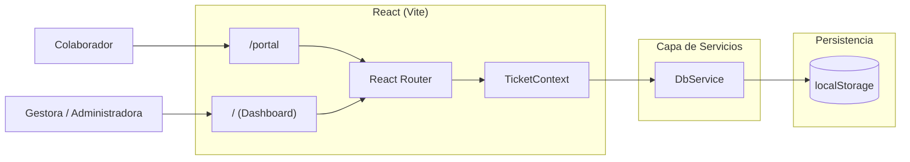

# Arquitectura del Sistema (Julio 2026 - Versión React)

Este documento describe la arquitectura real del proyecto a fecha de julio de 2026, validada contra el código fuente actual. Su objetivo es servir como mapa técnico para desarrolladores humanos y futuras IAs.

## 1. Resumen Ejecutivo

- El proyecto es una Single Page Application (SPA) en **React 18** servida localmente mediante **Vite**.
- La persistencia sigue sin usar un backend real y se apoya en `localStorage` (encapsulado en `DbService`).
- La aplicación usa **React Router** para enrutamiento cliente, y **Context API** (`TicketContext`) para la propagación de estado reactiva, abandonando la anterior arquitectura de eventos nativos (`CustomEvent`).
- Existen tres grandes agrupaciones funcionales unidas por el mismo layout (DashboardLayout) y una vista independiente (Portal):
  - `/` (Panel Principal)
  - `/actividades` (Tabla y métricas avanzadas)
  - `/gestion` (Vista Kanban y tabla de gestión)
  - `/portal` (Portal de autogestión para colaboradores)

## 2. Vista de Alto Nivel



## 3. Estilo Arquitectónico

### 3.1 Local-First
La aplicación se ejecuta de forma autónoma en el navegador. La lógica de negocio está en componentes React y la persistencia recae en `localStorage` mediante promesas simuladas.

### 3.2 SPA basada en React (Vite)
Se utiliza React con Hooks funcionales (`useState`, `useEffect`, `useMemo`, `useContext`) para la lógica y renderización.
Se preserva la capa de CSS modular, mapeando el DOM original a atributos `className` en JSX. Esto logra un diseño 1:1 sin depender de Tailwind u otras librerías externas.

### 3.3 Estado Reactivo Centralizado (Context API)
El estado de la aplicación es distribuido globalmente mediante `TicketContext.jsx`.
- Cualquier cambio realizado por un componente (ej. Crear Ticket, Actualizar Estado) dispara la recarga de datos en `TicketContext`.
- La propagación es instantánea a todos los componentes que consumen el contexto (`useTickets()`).

## 4. Componentes Principales

### 4.1 Dashboard Administrativo (Layout & Rutas)
Ubicación: `src/components/layout/DashboardLayout.jsx` y `src/pages/dashboard/`
Responsabilidades:
- Inyectar SideBar y TopBar.
- Renderizar vistas secundarias (`PanelPrincipal`, `Actividades`, `Gestion`).
- Sincronizar búsqueda global.

### 4.2 Panel Principal (`PanelPrincipal.jsx`)
Responsabilidades:
- Formularios de creación rápida (`RegistroActividadForm`).
- Visualización gráfica (`StatCards` con `react-chartjs-2`).
- Paneles laterales de estado (`WidgetMiEstado`, `WidgetSistemas`).

### 4.3 Gestión (`Gestion.jsx`)
Responsabilidades:
- Renderizar un toggle entre vistas Tabla / Kanban.
- Modal complejo reactivo para edición total de tickets.

### 4.4 Portal del Colaborador (`Portal.jsx`)
Responsabilidades:
- Formulario avanzado (condicionales para firmas y subida de archivos).
- Visualización de historial mediante filtrado reactivo del `TicketContext`.
- Visualización del estado del personal y servidores en vivo (localStorage event listener persistido para sincronización multi-pestaña).

## 5. Mapeo de Archivos Clave

- `src/App.jsx`: Root y declaración de `react-router-dom`.
- `src/contexts/TicketContext.jsx`: Orquestador de estado global.
- `src/services/DbService.js`: Interfaz asíncrona hacia `localStorage`.
- `src/data/tramitesData.js`: Fuente de la verdad de catálogos (Estructurales, Operativos).

## 6. CSS Modular (Heredado de Vanilla)

El proyecto logró adoptar React manteniendo toda la arquitectura de estilos Vanilla previa:

```
src/styles/
├── main.css              → Entry point
├── base/
│   ├── variables.css
│   └── reset.css
├── layout/
│   ├── sidebar.css
│   ├── topbar.css
│   └── grids.css
├── components/
│   ├── buttons.css
│   ├── cards.css
│   ├── forms.css
│   └── widgets.css
└── themes/
    └── portal-theme.css
```

## 7. Escalabilidad Técnica

Beneficios de la adopción de React:
- **Flujo de datos predecible:** `TicketContext` reemplaza la complejidad y race-conditions que generaba emitir `CustomEvents` dispersos en DOM.
- **Componentización:** Reutilización real de UI, sin duplicar HTML.
- **Backend-Ready:** La persistencia pasa exclusivamente por promesas (`DbService`), haciendo que migrar a una API (Axios/fetch) tome minutos.

Límites actuales:
- Sigue existiendo la dependencia de `localStorage`, limitando la colaboración concurrente real.
- Falta de autenticación y sesiones.

## 8. Recomendaciones para IAs Futuras

- La lógica de estado global vive en `TicketContext.jsx`.
- Nunca inyectar estilos inline (`style={{...}}`) a menos que sean animaciones dinámicas estrictamente necesarias. Mantenerse usando `className`.
- Los datos de trámites están en `src/data/tramitesData.js`.
- La capa de BD asíncrona sigue en `src/services/DbService.js`.
