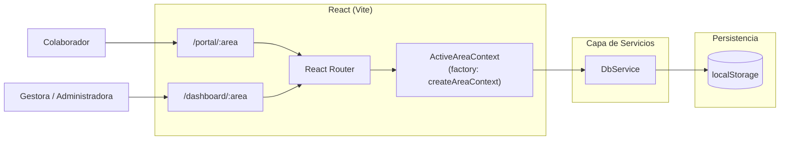

# Arquitectura del Sistema (Julio 2026 - Versión React)

Este documento describe la arquitectura real del proyecto a fecha de julio de 2026, validada contra el código fuente actual. Su objetivo es servir como mapa técnico para desarrolladores humanos y futuras IAs.

## 1. Resumen Ejecutivo

- El proyecto es una Single Page Application (SPA) en **React 18** servida localmente mediante **Vite**.
- La persistencia sigue sin usar un backend real y se apoya en `localStorage` (encapsulado en `DbService`).
- La aplicación usa **React Router** para enrutamiento cliente, y **Context API** (`TicketContext`) para la propagación de estado reactiva, abandonando la anterior arquitectura de eventos nativos (`CustomEvent`).
- Existen múltiples áreas de gestión unidas bajo los mismos layouts mediante rutas dinámicas:
  - `/dashboard/:area` (Panel Principal dinámico)
  - `/dashboard/:area/actividades` (Tabla y métricas avanzadas)
  - `/dashboard/:area/gestion` (Vista Kanban y tabla de gestión)
  - `/portal/:area` (Portal de autogestión para colaboradores)
  - `/database/:area` (Herramienta CRUD de mantenimiento de datos aislada por área)
  - `/login` (Autenticación con SHA-256 y control de acceso por área)

## 2. Vista de Alto Nivel



## 3. Estilo Arquitectónico

### 3.1 Local-First
La aplicación se ejecuta de forma autónoma en el navegador. La lógica de negocio está en componentes React y la persistencia recae en `localStorage` mediante promesas simuladas.

### 3.2 SPA basada en React (Vite)
Se utiliza React con Hooks funcionales (`useState`, `useEffect`, `useMemo`, `useContext`) para la lógica y renderización.
Se preserva la capa de CSS modular, mapeando el DOM original a atributos `className` en JSX. Esto logra un diseño 1:1 sin depender de Tailwind u otras librerías externas.

### 3.3 Estado Reactivo Centralizado (Context API)
El estado de la aplicación es distribuido globalmente mediante Contexts altamente dinámicos:
- **`createAreaContext.jsx`**: Un factory que genera contextos aislados (GE, GH, TI) inyectando la configuración específica de cada área.
- **`ActiveAreaContext.jsx`**: Actúa como un puente dinámico. Lee el parámetro `:area` de la URL, selecciona el contexto adecuado (ej. `GEContext`) y expone `useActiveArea()`.
- **`AuthContext.jsx`**: Maneja el estado de sesión, validación criptográfica (SHA-256), y bloqueo de cuentas a nivel local (`db_usuarios`).
- **`NotificationContext.jsx`**: Gestiona el ciclo de vida de notificaciones visuales, mientras que `useStorageSync.js` maneja la alerta sonora basada en cambios de `localStorage` de acuerdo al `storageKey` del área activa.

Cualquier cambio realizado por un componente dispara la recarga reactiva en todos los consumidores (`useActiveArea()`, `useNotifications()`).

### 3.4 Métricas de Tiempo Automatizadas
El `TicketContext` intercepta los cambios de estado de los tickets para registrar métricas de forma automática:
- **`fechaInicio`** + **`fechaInicioTimestamp`**: Se captura al pasar a "En progreso" (solo la primera vez).
- **`fechaFin`** + **`fechaFinTimestamp`**: Se captura al pasar a "Resuelto", "Finalizado" o "Cerrado".
- **`tiempo`**: Cálculo matemático de la diferencia entre inicio y fin, en formato `HH:mm:ss` (compatible con Excel / herramientas de análisis).
- **Registros retrospectivos**: Si se crea un ticket directamente como resuelto con fechas manuales (`YYYY-MM-DD`), el Context parsea las fechas y calcula el `tiempo` igualmente.

## 4. Componentes Principales

### 4.1 Dashboard Administrativo (Layout & Rutas)
Ubicación: `src/components/layout/DashboardLayout.jsx` y `src/pages/dashboard/`
Responsabilidades:
- Inyectar SideBar y TopBar.
- Renderizar vistas secundarias (`PanelPrincipal`, `Actividades`, `Gestion`).
- Sincronizar búsqueda global.

### 4.2 Panel Principal (`PanelPrincipal.jsx`)
Responsabilidades:
- Formularios de creación rápida (`RegistroActividadForm`).
- Visualización gráfica (`StatCards` con `react-chartjs-2`).
- Paneles laterales de estado (`WidgetMiEstado`, `WidgetSistemas`).

### 4.3 Gestión (`Gestion.jsx`)
Responsabilidades:
- Renderizar un toggle entre vistas Tabla / Kanban.
- Modal complejo reactivo para edición total de tickets.
- Campos de `fechaProgramada` y `accion` (notas técnicas del resolutor) integrados en el modal.

### 4.4 Actividades (`Actividades.jsx`)
Responsabilidades:
- Tabla principal con sistema de filtrado avanzado.
- Visualización de métricas y resumen de actividades.

### 4.5 Portal del Colaborador (`Portal.jsx`)
Responsabilidades:
- Formulario avanzado (condicionales para firmas y subida de archivos).
- Visualización de historial mediante filtrado reactivo del `TicketContext`.
- Subcomponentes: `TicketForm.jsx`, `TicketHistory.jsx`, `StaffStatus.jsx`, `SystemStatus.jsx`.
- Visualización del estado del personal y servidores en vivo (localStorage event listener persistido para sincronización multi-pestaña).

### 4.6 Database (`AreaDatabase.jsx`)
Responsabilidades:
- Herramienta CRUD independiente para mantenimiento de `localStorage`.
- Consumo dinámico de `useActiveArea` para aislar `responsables` y `actividades` por área.
- Ruta: `/database/:area` (fuera del DashboardLayout y restringida solo para admin_ti).

### 4.7 Configuración Global (`Settings.jsx` y `SettingsManager.js`)
Responsabilidades:
- Reemplaza la antigua configuración en código duro (`tramitesData.js`).
- Permite a las áreas agregar/quitar grupos y trámites dinámicamente (`db_settings`).
- Incluye el **Módulo de Administración de Cuentas** exclusivo para TI (desbloqueos y reseteo de contraseñas).

### 4.7 Notificaciones (`NotificationCenter.jsx` + `NotificationHelper.js`)
Responsabilidades:
- Panel desplegable de notificaciones integrado en el `Topbar`.
- `NotificationHelper.js`: Utilidad de servicio que encapsula alertas sonoras (`AudioContext`) y notificaciones del navegador (Browser Notifications API).

## 5. Mapeo de Archivos Clave

- `src/App.jsx`: Root y declaración de `react-router-dom`.
- `src/shared/contexts/createAreaContext.jsx`: Factory para crear contextos de área.
- `src/shared/contexts/ActiveAreaContext.jsx`: Orquestador dinámico que provee la información del área según la URL.
- `src/shared/contexts/AuthContext.jsx`: Orquestador de inicio de sesión, bloqueo de seguridad y sesiones.
- `src/contexts/NotificationContext.jsx`: Orquestador de notificaciones y sincronización multi-pestaña.
- `src/shared/services/SettingsManager.js`: Interfaz asíncrona hacia `localStorage` para la configuración de trámites.
- `src/services/DbService.js`: Interfaz asíncrona hacia `localStorage` para las Actividades (Tickets).
- `src/services/NotificationHelper.js`: Alertas sonoras y notificaciones del navegador.

## 6. CSS Modular (Heredado de Vanilla)

El proyecto logró adoptar React manteniendo toda la arquitectura de estilos Vanilla previa:

```
src/styles/
├── main.css              → Entry point
├── base/
│   ├── variables.css
│   └── reset.css
├── layout/
│   ├── sidebar.css
│   ├── topbar.css
│   └── grids.css
├── components/
│   ├── buttons.css
│   ├── cards.css
│   ├── forms.css
│   └── widgets.css
└── themes/
    └── portal-theme.css
```

## 7. Escalabilidad Técnica

Beneficios de la adopción de React:
- **Flujo de datos predecible:** `TicketContext` reemplaza la complejidad y race-conditions que generaba emitir `CustomEvents` dispersos en DOM.
- **Componentización:** Reutilización real de UI, sin duplicar HTML.
- **Backend-Ready:** La persistencia pasa exclusivamente por promesas (`DbService`), haciendo que migrar a una API (Axios/fetch) tome minutos.

Límites actuales:
- Sigue existiendo la dependencia de `localStorage`, limitando la colaboración concurrente real.
- Falta migrar definitivamente la persistencia a una base de datos real en un backend (Node.js/SQL) para multiusuario global.

## 8. Recomendaciones para IAs Futuras

- La lógica de estado global vive en `ActiveAreaContext.jsx` que funciona como proxy hacia `GEContext`, `GHContext` o `TIContext`.
- La seguridad y protección de rutas recae en `AuthContext.jsx` y el wrapper `ProtectedRoute.jsx`.
- Nunca inyectar estilos inline (`style={{...}}`) a menos que sean animaciones dinámicas estrictamente necesarias. Mantenerse usando `className`.
- Los datos de trámites ahora son 100% dinámicos en el navegador mediante `SettingsManager.js` (`db_settings`). Ya NO EXISTE el archivo de configuraciones duras estáticas.
- Las métricas de tiempo (`fechaInicio`, `fechaFin`, `tiempo`) se calculan automáticamente en `TicketContext` — no duplicar esta lógica en componentes.
