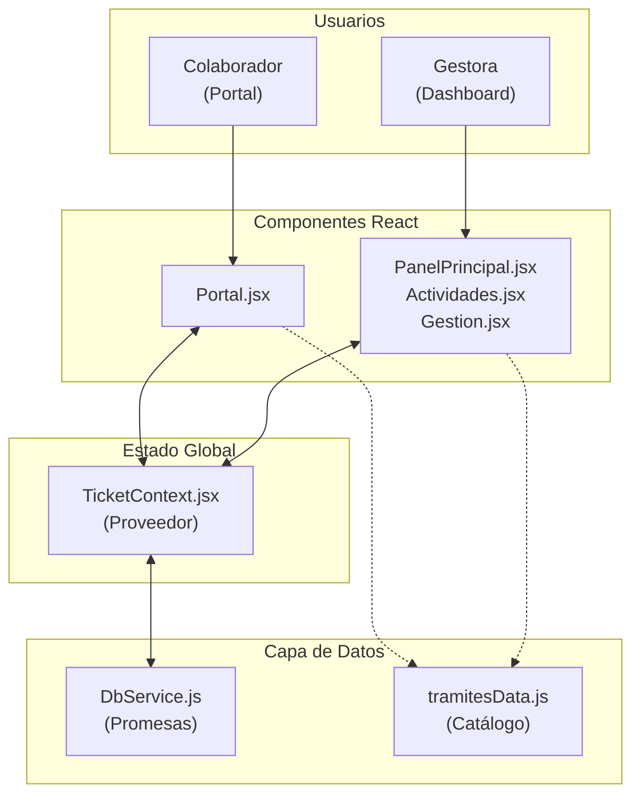

# 🔗 Mapa de Dependencias — Gestión Empresarial (React / Julio 2026)

> **REGLA:** Antes de modificar cualquier archivo, consulta este mapa para saber qué otros archivos se verán afectados.

---

## Flujo de Datos Principal (React Context)

---

## Componentes y sus Conexiones

### 📄 Contexto Global (`src/contexts/TicketContext.jsx`)
- **Propósito:** Orquesta el estado global de tickets y catálogos, reemplazando el bus de `CustomEvent` que existía en Vanilla JS.
- **Expone:** `actividades`, `solicitantes`, `responsables`, `addTicket()`, `updateTicket()`, `refreshTickets()`.
- **Depende de:** `DbService.js` (para leer/escribir en localStorage).
- **Consumido por:** Prácticamente todas las páginas y componentes del proyecto vía el hook `useTickets()`.

---

### 📄 Portal del Colaborador (`src/pages/Portal.jsx`)
- **Ruta:** `/portal`
- **Propósito:** Formulario autónomo donde los colaboradores envían solicitudes.
- **Dependencias Directas:**
  - `useTickets()` → Lee solicitantes, lee actividades (para filtrar el historial personal del usuario).
  - `addTicket()` → Genera tickets con prefijo **REQ-XXX** (DEC-005).
  - `tramitesData.js` → Renderiza trámites dinámicamente según área seleccionada.
- **Sincronización:** Escucha el evento `storage` nativo del navegador para enterarse en tiempo real de cambios en `db_estado_personal` (para el widget de staff IT) y `db_sistemas`.

---

### 📄 Dashboard Administrativo (Multi-página reactiva)

#### 📄 `src/App.jsx`
- Raíz del árbol de React. Implementa `BrowserRouter` y envuelve la app en `TicketContext.Provider`.
- Rutea `/portal` independiente, y `/`, `/actividades`, `/gestion` bajo el `DashboardLayout`.

#### 📄 `src/components/layout/DashboardLayout.jsx`
- **Propósito:** Shell principal de la app administrativa. Contiene Sidebar y Topbar.
- Emite un evento document-level (`searchTriggered`) desde la barra de búsqueda del Topbar, que es interceptado por las páginas hijas.

#### 📄 `src/pages/dashboard/PanelPrincipal.jsx` (Ruta `/`)
- Renderiza métricas (`StatCards` usando `react-chartjs-2`).
- Contiene el formulario rápido `RegistroActividadForm`.
- Renderiza los widgets `WidgetMiEstado` y `WidgetSistemas`.

#### 📄 `src/pages/dashboard/Actividades.jsx` (Ruta `/actividades`)
- Tabla detallada con múltiples filtros combinados.
- Recrea las tarjetas `.quick-stats` mediante `useMemo` iterando sobre los tickets activos extraídos de `useTickets()`.

#### 📄 `src/pages/dashboard/Gestion.jsx` (Ruta `/gestion`)
- Toggle de vistas Tabla y Kanban.
- **Modal de edición complejo:** Inyecta un `
` controlado por estado de React.
- Muta los tickets llamando a `updateTicket()` del context.

---

### 📄 CSS Modular (`src/styles/`)
- Mantenido exactamente igual que en la versión Vanilla.
- **Punto de Entrada:** `main.css`.
- **Importante:** React inyecta estas clases usando `className="..."`.
- `portal-theme.css` sigue siendo crucial para el override de scroll y overrides de `.badge` en el entorno del Portal.

---

### 📄 Capa de Servicios (`src/services/DbService.js`)
- Persistencia temporal. Promisifica operaciones sobre `localStorage`.
- Las mismas claves siguen activas (`db_actividades`, `db_solicitantes`, `db_responsables`, `db_sistemas`, `db_estado_personal`).

---

## ⚠️ Puntos Críticos de Mantenibilidad

| Componente | Riesgo / Detalle |
|---|---|
| `tramitesData.js` | Única fuente de verdad para el catálogo de trámites. Si agregas uno nuevo, hazlo solo allí. |
| Generación de IDs | `RegistroActividadForm` usa `TKT-XXX`, mientras que `Portal` usa `REQ-XXX`. Esto es **intencional** para diferenciar el origen de creación. |
| Evento `searchTriggered` | Aunque el proyecto migró a React, el Topbar y las Tablas usan `document.addEventListener` para pasar el texto del buscador. |
| `body className` en Portal | `Portal.jsx` utiliza un `useEffect` para inyectar `document.body.className = 'portal'` al montarse, asegurando que los estilos de layout apliquen. Cuidado con removerlo. |
