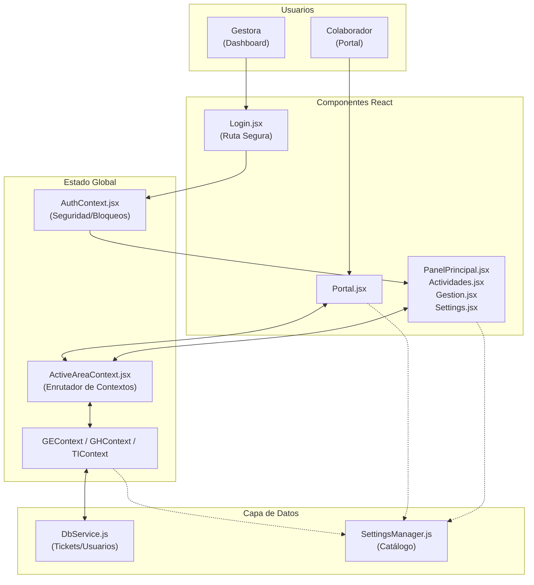

# 🔗 Mapa de Dependencias — Gestión Empresarial (React / Julio 2026)

> **REGLA:** Antes de modificar cualquier archivo, consulta este mapa para saber qué otros archivos se verán afectados.

---

## Flujo de Datos Principal (React Context)

---

## Componentes y sus Conexiones

### 📄 Contexto Dinámico (`src/shared/contexts/ActiveAreaContext.jsx`)
- **Propósito:** Actúa como proxy que lee la URL y devuelve el contexto correcto (`GEContext`, `GHContext` o `TIContext`).
- **Expone:** `ctx` (con `actividades`, `solicitantes`, `responsables`, `addTicket()`, etc) y `config` (datos de área).
- **Depende de:** `createAreaContext.jsx` que a su vez consume `DbService.js`.
- **Consumido por:** Prácticamente todas las páginas y componentes del proyecto vía el hook `useActiveArea()`.

---

### 📄 Portal del Colaborador (`src/pages/Portal.jsx`)
- **Rutas:** `/portal` y `/portal/:area`
- **Propósito:** Formulario autónomo donde los colaboradores envían solicitudes.
- **Dependencias Directas:**
  - `useTickets()` → Lee solicitantes, lee actividades (para filtrar el historial personal del usuario).
  - `addTicket()` → Genera tickets con prefijo único por área (**TI-XXX**, **GE-XXX**, **GH-XXX**) (DEC-005).
  - `UploadService.js` → Orquesta la subida física de archivos adjuntos enviando el área y el ID al servidor.
  - `SettingsManager.js` → Renderiza trámites dinámicamente según área seleccionada.
- **Sincronización:** Escucha el evento `storage` nativo del navegador para enterarse en tiempo real de cambios en estado de personal y sistemas.

---

### 📄 Dashboard Administrativo (Multi-página reactiva)

#### 📄 `src/App.jsx`
- Raíz del árbol de React. Implementa `BrowserRouter`.
- Rutea `/portal/:area` independiente, y `/dashboard/:area`, `/dashboard/:area/actividades`, `/dashboard/:area/gestion` bajo el `DashboardLayout` provisto por `ActiveAreaProvider`.

#### 📄 `src/components/layout/DashboardLayout.jsx`
- **Propósito:** Shell principal de la app administrativa. Contiene Sidebar y Topbar.
- Emite un evento document-level (`searchTriggered`) desde la barra de búsqueda del Topbar, que es interceptado por las páginas hijas.

#### 📄 `src/pages/dashboard/PanelPrincipal.jsx` (Ruta `/dashboard/:area`)
- Renderiza métricas (`StatCards` usando `react-chartjs-2`).
- Contiene el formulario rápido `RegistroActividadForm`.
- Renderiza los widgets `WidgetMiEstado` y `WidgetSistemas`.

#### 📄 `src/pages/dashboard/Actividades.jsx` (Ruta `/dashboard/:area/actividades`)
- Tabla detallada con múltiples filtros combinados.
- Recrea las tarjetas `.quick-stats` mediante `useMemo` iterando sobre los tickets activos extraídos de `useTickets()`.

#### 📄 `src/pages/dashboard/Gestion.jsx` (Ruta `/dashboard/:area/gestion`)
- Toggle de vistas Tabla y Kanban.
- **Modal de edición complejo:** Inyecta un `
` controlado por estado de React.
- Muta los tickets llamando a `updateTicket()` del context.

---

### 📄 CSS Modular (`src/styles/`)
- Mantenido exactamente igual que en la versión Vanilla.
- **Punto de Entrada:** `main.css`.
- **Importante:** React inyecta estas clases usando `className="..."`.
- `portal-theme.css` sigue siendo crucial para el override de scroll y overrides de `.badge` en el entorno del Portal.

---

### 📄 Capa de Servicios (`src/services/DbService.js` y `SettingsManager.js`)
- Persistencia temporal. Promisifican operaciones sobre `localStorage`.
- `DbService.js` interactúa con las llaves de tickets (`db_actividades_ge`, etc.).
- `SettingsManager.js` controla las llaves de configuración global (`db_settings`) para nutrir dinámicamente los menús de trámites.
- `AuthContext.jsx` controla dinámicamente `db_usuarios` con soporte para validación criptográfica (SHA-256).

---

## ⚠️ Puntos Críticos de Mantenibilidad

| Componente | Riesgo / Detalle |
|---|---|
| `SettingsManager.js` | Única fuente de verdad para el catálogo de trámites (reemplazó al antiguo y estático `tramitesData.js`). |
| Generación de IDs | `RegistroActividadForm` usa `TKT-XXX`, mientras que los Portales usan prefijos de área (`TI-XXX`, `GE-XXX`, `GH-XXX`). Esto es **vital** para crear las carpetas físicas correctamente en el Backend Node.js de uploads. |
| Seguridad en Rutas | Todas las páginas dentro de `/dashboard` están envueltas en `<ProtectedRoute>` que comprueba que `currentUser.area` coincida con la `:area` de la URL. |
| `body className` en Portal | `Portal.jsx` utiliza un `useEffect` para inyectar `document.body.className = 'portal'` al montarse, asegurando que los estilos de layout apliquen. Cuidado con removerlo. |
