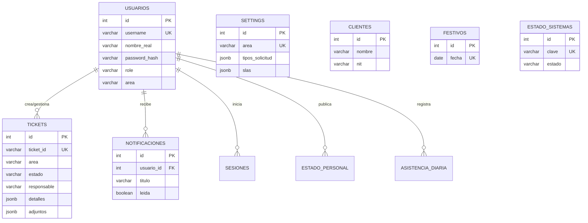

# 🚀 MANUAL DE MIGRACIÓN A BACKEND REAL (PostgreSQL + Ubuntu Server)

> **PROPÓSITO:** Este documento es la fuente de verdad absoluta para migrar el proyecto "Gestor" desde `localStorage` del navegador hacia un backend real con **PostgreSQL** en un **Ubuntu Server**. Está diseñado para que una IA o desarrollador pueda ejecutar la migración con mínimo margen de error.
>
> **REGLA CRÍTICA:** NO empieces a codificar sin leer este documento completo primero.

---

# FASE 1: INVENTARIO COMPLETO DE localStorage

El sistema actualmente almacena TODA su información en el localStorage del navegador del usuario. A continuación se documenta cada clave, su estructura JSON exacta, sus campos, y los archivos del código fuente que la leen y escriben.

---

## 1.1 — db_usuarios (TABLA MAESTRA DE USUARIOS)

- **Criticidad:** MÁXIMA — Es la columna vertebral de autenticación, roles y permisos.
- **Tipo de dato:** Array de Object
- **Descripción:** Contiene TODOS los usuarios del sistema: administradores, gestores y empleados.

### Estructura de cada objeto:

```json
{
  "id": "U-01",
  "username": "admin_ti",
  "nombreReal": "Administrador TI",
  "passwordHash": "8c6976e5b5410415bde908bd4dee15dfb167a9c873fc4bb8a81f6f2ab448a918",
  "role": "admin_ti",
  "area": "ti",
  "avatar": "",
  "cargo": "Ingeniero de Sistemas",
  "cedula": "1001234567",
  "celular": "3001234567",
  "jefeInmediato": "Director de TI",
  "bloqueado": false,
  "bloqueadoHasta": null,
  "intentosFallidos": 0
}
```

### Campos detallados:

| Campo | Tipo | Obligatorio | Descripción |
|---|---|---|---|
| id | string | SI | Identificador único (U-01, U-02, ...). Autogenerado. |
| username | string | SI | Login único del usuario. Case-insensitive para búsquedas. |
| nombreReal | string | SI | Nombre completo visible en la interfaz. |
| passwordHash | string | SI | Hash SHA-256 de la contraseña (64 caracteres hex). |
| role | string | SI | Uno de: admin_ti, gestor, solicitante. |
| area | string | NO | Área asignada: ge, gh, ti. null para solicitante. |
| avatar | string | NO | URL de avatar (actualmente vacío). |
| cargo | string | NO | Cargo laboral del usuario. |
| cedula | string | NO | Número de documento de identidad. |
| celular | string | NO | Número de celular. |
| jefeInmediato | string | NO | Nombre del jefe inmediato. |
| bloqueado | boolean | SI | true si la cuenta está suspendida. |
| bloqueadoHasta | number o null | NO | Timestamp Unix de cuándo se desbloquea automáticamente (15 min). |
| intentosFallidos | number | SI | Contador de intentos de login fallidos. Se resetea a 0 al loguearse correctamente. Bloquea a los 4. |

### Roles del sistema:

| Valor de role | Acceso |
|---|---|
| admin_ti | Dashboard de todas las áreas + Gestión de Usuarios + Base de Datos |
| gestor | Dashboard SOLO de su área asignada (area) |
| solicitante | SOLO Portal de colaboradores (/portal/:area) |

### Archivos que LEEN esta clave:

| Archivo | Línea(s) | Operación |
|---|---|---|
| src/shared/services/DbService.js | L10, L34 | getSolicitantes(), getResponsables() |
| src/shared/contexts/AuthContext.jsx | L20, L45, L53, L75, L155 | initUsersDB(), login(), changePassword() |
| src/shared/contexts/createAreaContext.jsx | L180 | getSolicitanteCargo() |
| src/pages/dashboard/settings/views/SettingsUsuarios.jsx | L34 | Cargar tabla de usuarios |
| src/pages/dashboard/ReportesGH.jsx | L66 | Lista de empleados para Kanban de asistencia |
| src/pages/database/AreaDatabase.jsx | L36, L65, L81 | Pestaña de Responsables y Solicitantes |
| src/pages/dashboard/Gestion.jsx | L425 | Lookup de datos del solicitante en el modal |
| src/pages/dashboard/modals/ActaAuxilioPdf.jsx | L8 | Lookup de cédula para firma legal |
| src/pages/dashboard/modals/ActaDeduccion.jsx | L8 | Lookup de cédula para firma legal |
| src/components/portal/forms/FormGH.jsx | L79 | Autocompletar datos de perfil del empleado |
| src/components/portal/PortalLayout.jsx | L305 | Lista de personal para el widget de estado |

### Archivos que ESCRIBEN esta clave:

| Archivo | Línea(s) | Operación |
|---|---|---|
| src/shared/contexts/AuthContext.jsx | L36, L97, L120, L127, L170 | initUsersDB(), login(), changePassword() |
| src/pages/dashboard/settings/views/SettingsUsuarios.jsx | L192 aprox | CRUD de usuarios + Importación masiva |

---

## 1.2 — session_token (SESIÓN ACTIVA)

- **Criticidad:** MEDIA — Se reemplazará por JWT en la migración.
- **Tipo de dato:** Object

### Estructura:

```json
{
  "user": {
    "id": "U-01",
    "username": "admin_ti",
    "nombreReal": "Administrador TI",
    "role": "admin_ti",
    "area": "ti",
    "cargo": "Ingeniero de Sistemas"
  },
  "expiresAt": 1753920000000
}
```

### Archivos que la usan:

| Archivo | Operación |
|---|---|
| src/shared/contexts/AuthContext.jsx | Lee al cargar la app, escribe al hacer login, elimina al hacer logout |
| src/pages/dashboard/settings/views/SettingsUsuarios.jsx | Lee para verificar si el usuario editado es el logueado |

---

## 1.3 — db_actividades_ge / db_actividades_gh / db_actividades_ti (TICKETS POR ÁREA)

- **Criticidad:** MÁXIMA — Son los tickets/solicitudes del sistema.
- **Tipo de dato:** Array de Object
- **Descripción:** Cada área tiene su propia colección de tickets. Las 3 comparten la misma estructura de objeto.

### Estructura de cada ticket:

```json
{
  "id": "GH-001",
  "fechaCreacion": "29/7/2026, 2:30:00 p.m.",
  "fechaISO": "2026-07-29T19:30:00.000Z",
  "nombre": "Juan Pérez",
  "cargo": "Auxiliar Contable",
  "solicitante": "Juan Pérez",
  "solicitud": "Solicito permiso por cita médica el día 30 de julio.",
  "estado": "Pendiente",
  "prioridad": "Media",
  "tipo": "Requerimiento",
  "responsable": "Gestor de RRHH",
  "tipoSolicitud": "Permisos",
  "clasificacion": "Salud",
  "fechaInicio": "29/7/2026, 3:00:00 p.m.",
  "fechaInicioTimestamp": 1753891200000,
  "fechaFin": "29/7/2026, 4:30:00 p.m.",
  "fechaFinTimestamp": 1753896600000,
  "tiempo": "01:30:00",
  "fechaProgramada": "2026-07-30",
  "accion": "Se aprobó el permiso. Firma del jefe adjunta.",
  "adjuntos": ["http://localhost:3001/uploads/gh/GH-001/archivo.pdf"],
  "novedadNomina": true,
  "fechaPausa": null,
  "tiempoPausadoTotal": 0,
  "agentPauseStart": null,
  "fechaCierreTimestamp": null,
  "detalles": {
    "cedula": "1001234567",
    "cargo": "Auxiliar Contable",
    "celular": "3001234567",
    "jefeInmediato": "María González",
    "tipoPermiso": "Salud",
    "fechaPermiso": "2026-07-30",
    "horaInicio": "08:00",
    "horaFin": "12:00",
    "compensacion": "Repone el sábado"
  },
  "firmaTimestamp": "2026-07-29T19:29:55.123Z",
  "firmaISO": "2026-07-29T19:29:55.123Z",
  "firmaValidada": true,
  "cliente": "Empresa ABC S.A.S"
}
```

### Campos detallados del Ticket:

| Campo | Tipo | Descripción |
|---|---|---|
| id | string | ID único con prefijo de área: GE-001, GH-001, TI-001, TKT-001 (dashboard). |
| fechaCreacion | string | Fecha legible (locale). |
| fechaISO | string | Fecha ISO 8601. |
| nombre | string | Nombre del solicitante (copia de solicitante). |
| cargo | string | Cargo del solicitante al momento de crear el ticket. |
| solicitante | string | Nombre completo del solicitante. |
| solicitud | string | Descripción textual de la solicitud. |
| estado | string | Uno de: Pendiente, En progreso, Suspendido, Resuelto, Cerrado, Finalizado. |
| prioridad | string | Urgente, Alta, Media, Baja. NO existe para GH (se elimina en migración). |
| tipo | string | Incidente, Requerimiento. NO existe para GH. |
| responsable | string | Nombre del gestor asignado. |
| tipoSolicitud | string | Categoría principal (ej. Permisos, Soporte Técnico). |
| clasificacion | string | Sub-trámite específico (ej. Salud, Soporte). |
| fechaInicio | string | Fecha legible de cuándo se pasó a En progreso. |
| fechaInicioTimestamp | number | Timestamp Unix de inicio. |
| fechaFin | string | Fecha legible de cuándo se resolvió. |
| fechaFinTimestamp | number | Timestamp Unix de resolución. |
| tiempo | string | Duración calculada en formato HH:mm:ss. |
| fechaProgramada | string | Fecha deadline (formato YYYY-MM-DD). |
| accion | string | Notas/bitácora del gestor. |
| adjuntos | Array de string | URLs de archivos adjuntos subidos al backend Node.js. |
| novedadNomina | boolean | Flag exclusivo de GH: si el ticket afecta la nómina. |
| detalles | object o null | JSON dinámico con campos específicos del trámite. |
| firmaTimestamp | string | ISO timestamp de firma electrónica del empleado. |
| firmaValidada | boolean | Si la firma fue validada con credenciales. |
| fechaPausa | number o null | Timestamp de cuándo se suspendió el SLA. |
| tiempoPausadoTotal | number | Milisegundos totales que el SLA estuvo pausado. |
| agentPauseStart | number o null | Timestamp de cuándo el agente cambió estado a ausente/almuerzo/reunión. |
| fechaCierreTimestamp | number o null | Timestamp de cierre automático (72h post-resolución). |
| cliente | string | Nombre de la empresa/cliente asociado (usado por GH para convenios). |

### Archivos que LEEN estas claves:

| Archivo | Clave(s) |
|---|---|
| src/shared/services/DbService.js | Las 3 (vía parámetro key) |
| src/shared/contexts/createAreaContext.jsx | La del área activa (vía config.storageKey) |
| src/components/portal/forms/FormGH.jsx | db_actividades_gh |
| src/components/portal/forms/FormGE.jsx | db_actividades_ge |
| src/components/portal/forms/FormTI.jsx | db_actividades_ti |
| src/components/portal/TicketForm.jsx | db_actividades_ge |

### Archivos que ESCRIBEN estas claves:

| Archivo | Operación |
|---|---|
| src/shared/services/DbService.js | guardarActividad(), saveActividades(), autoCloseTickets(), updateTicketsAgentPauseState() |
| src/shared/contexts/createAreaContext.jsx | updateTicket() (vía DbService.saveActividades()) |

---

## 1.4 — db_settings (CONFIGURACIÓN GLOBAL DE TRÁMITES Y SLA)

- **Criticidad:** ALTA — Define qué trámites existen y los tiempos SLA.
- **Tipo de dato:** Object (mapa por área)

### Estructura:

```json
{
  "ge": {
    "tiposSolicitud": [
      {
        "nombre": "Estructurales y Legales",
        "tramites": ["Creación y/o Cancelación de empresas", "Devolución de saldo..."]
      }
    ],
    "slas": { "Urgente": 2, "Alta": 8, "Media": 24, "Baja": 48 }
  },
  "gh": {
    "tiposSolicitud": [
      {
        "nombre": "Permisos",
        "tramites": ["Personal", "Salud", "Educativo", "Licencia no remunerada (LNR)"],
        "internalOnly": false
      }
    ],
    "slas": { "Urgente": 2, "Alta": 8, "Media": 24, "Baja": 48 }
  },
  "ti": {
    "tiposSolicitud": [],
    "slas": { "Urgente": 2, "Alta": 8, "Media": 24, "Baja": 48 }
  }
}
```

### Archivos que la usan:

| Archivo | Operación |
|---|---|
| src/shared/services/SettingsManager.js | initSettingsDB(), getAreaSettings(), saveAreaSettings() |
| Portal Forms (vía SettingsManager) | Renderizar los dropdowns de trámites |
| src/pages/dashboard/settings/views/SettingsTramites.jsx | Editar trámites |
| src/pages/dashboard/settings/views/SettingsSLA.jsx | Editar tiempos SLA |

---

## 1.5 — db_festivos (DÍAS FESTIVOS GLOBALES)

- **Tipo de dato:** Array de string
- **Descripción:** Lista de fechas festivas en formato YYYY-MM-DD. El motor SLA las trata como domingos.

### Estructura:

```json
["2026-01-01", "2026-01-06", "2026-03-23", "2026-05-01", "2026-07-20"]
```

### Archivos que la usan:

| Archivo | Operación |
|---|---|
| src/shared/services/DbService.js | getFestivos(), saveFestivos() |
| src/shared/utils/businessHours.js | Lee directo para calcular SLA |
| src/pages/dashboard/ReportesGH.jsx | Lee directo para calcular cortes de asistencia |
| src/pages/dashboard/settings/views/SettingsFestivos.jsx | CRUD de festivos |

---

## 1.6 — db_sistemas (ESTADO DE SISTEMAS/SERVIDORES)

- **Tipo de dato:** Object

### Estructura:

```json
{
  "servidor": { "estado": "ok", "mensaje": "" },
  "contable": { "estado": "warning", "mensaje": "Lentitud en módulo de facturación" },
  "red": { "estado": "ok", "mensaje": "" }
}
```

### Archivos que la usan:

| Archivo | Operación |
|---|---|
| src/shared/services/DbService.js | getSistemas(), saveSistemas() |
| src/pages/dashboard/components/WidgetSistemas.jsx | Lee y permite editar estados |
| src/components/portal/PortalLayout.jsx | Lee para mostrar en el portal del empleado |

---

## 1.7 — db_estado_personal (ESTADO DE GESTORES EN TIEMPO REAL)

- **Tipo de dato:** Object (mapa por nombre de gestor)

### Estructura:

```json
{
  "Gestor de RRHH": {
    "nombre": "Gestor de RRHH",
    "estado": "disponible",
    "timestamp": 1753891200000
  }
}
```

### Estados posibles:

| Valor | Label en UI | Pausa SLA |
|---|---|---|
| disponible | Disponible (En Oficina) | No |
| en_desarrollo | Disponible (Trabajo en casa) | No |
| reunion | En Reunión | Sí |
| almuerzo | Hora de Almuerzo | Sí |
| atendiendo | Ocupado | No |
| ausente | Ausente (No laborando) | Sí |

### Archivos que la usan:

| Archivo | Operación |
|---|---|
| src/shared/services/DbService.js | getEstadoPersonal(), saveEstadoPersonal() |
| src/pages/dashboard/components/WidgetMiEstado.jsx | Lee y escribe al publicar estado |
| src/components/portal/PortalLayout.jsx | Lee para mostrar a empleados |

---

## 1.8 — db_asistencia_diaria (REGISTRO DE ASISTENCIA DIARIA - GH)

- **Tipo de dato:** Object (mapa por nombre de empleado)

### Estructura:

```json
{
  "Juan Pérez": {
    "nombre": "Juan Pérez",
    "ubicacion": "Oficina",
    "estado": "En progreso",
    "timestamp": 1753857600000,
    "fechaCreacion": "29/7/2026, 7:30:00 a.m.",
    "area": "gh"
  }
}
```

### Archivos que la usan:

| Archivo | Operación |
|---|---|
| src/shared/services/DbService.js | getAsistenciaDiaria(), saveAsistenciaDiaria(), cleanAsistenciaDiariaSync() |
| src/pages/dashboard/ReportesGH.jsx | Lee para poblar el tablero Kanban |
| src/pages/database/AreaDatabase.jsx | Lee para mostrar en base de datos |

---

## 1.9 — db_historico_asistencia (HISTÓRICO DE ASISTENCIA)

- **Tipo de dato:** Array de Object

### Estructura de cada registro:

```json
{
  "id": "1753920000000",
  "nombre": "Juan Pérez",
  "ubicacion": "Oficina",
  "estado": "Resuelto",
  "timestamp": 1753857600000,
  "fechaFinISO": "2026-07-29T00:14:00.000Z",
  "accion": "Fin de Turno (Automático)",
  "fechaRegistro": "29/7/2026, 7:14:00 p.m."
}
```

### Archivos que la usan:

| Archivo | Operación |
|---|---|
| src/shared/services/DbService.js | cleanAsistenciaDiariaSync(), registrarHistoricoAsistencia() |
| src/pages/database/AreaDatabase.jsx | Lee para mostrar en la pestaña Histórico |

---

## 1.10 — db_notificaciones (CENTRO DE NOTIFICACIONES)

- **Tipo de dato:** Array de Object (máximo 30 items)

### Estructura:

```json
[
  {
    "id": "N-1753891200000",
    "titulo": "Nueva solicitud",
    "texto": "Juan Pérez envió una solicitud de Permisos.",
    "fecha": "29/7/2026, 2:30:00 p.m.",
    "leida": false
  }
]
```

### Archivos que la usan:

| Archivo | Operación |
|---|---|
| src/shared/contexts/NotificationContext.jsx | Todo el CRUD de notificaciones |

---

## 1.11 — db_clientes (CATÁLOGO DE EMPRESAS/CLIENTES)

- **Tipo de dato:** Array de Object

### Estructura:

```json
[
  { "id": "CLI-1753891200000", "nombre": "Empresa ABC S.A.S", "nit": "900123456-7" }
]
```

### Archivos que la usan:

| Archivo | Operación |
|---|---|
| src/pages/dashboard/settings/views/SettingsClientes.jsx | CRUD completo |
| src/components/portal/forms/FormGH.jsx | Lee para mostrar dropdown de clientes |

---

## 1.12 — db_solicitantes (LISTA LEGACY DE SOLICITANTES)

- **Tipo de dato:** Array de Object o string
- **Descripción:** Lista heredada del sistema Vanilla. Hoy el sistema lee solicitantes directamente de db_usuarios filtrando role igual a solicitante. Esta clave existe por retrocompatibilidad.

### Archivos que la usan:

| Archivo | Operación |
|---|---|
| src/shared/services/DbService.js | saveSolicitantes() |
| src/shared/contexts/createAreaContext.jsx | addSolicitante(), removeSolicitante() |

---

## 1.13 — db_mi_seleccion_{area} (PREFERENCIA LOCAL DEL GESTOR)

- **Tipo de dato:** Object
- **Descripción:** Guarda la última selección del gestor en el widget Mi Estado. Es una clave por área (db_mi_seleccion_ge, db_mi_seleccion_gh, db_mi_seleccion_ti).

### Estructura:

```json
{ "nombre": "Gestor de RRHH", "estado": "disponible", "timestamp": 1753891200000 }
```

### Archivos que la usan:

| Archivo | Operación |
|---|---|
| src/pages/dashboard/components/WidgetMiEstado.jsx | Lee y escribe |

---

## 1.14 — sidebar_collapsed (PREFERENCIA UI LOCAL)

- **Tipo de dato:** string (true o false)
- **Descripción:** Recuerda si el usuario colapsó el sidebar. NO se migra a PostgreSQL, se queda en localStorage como preferencia local del navegador.

### Archivos que la usan:

| Archivo | Operación |
|---|---|
| src/shared/components/layout/Sidebar.jsx | Lee y escribe |

---

## 1.15 — Resumen de Claves para Migración

| Num | Clave localStorage | Migrar a PostgreSQL | Tabla SQL Sugerida |
|---|---|---|---|
| 1 | db_usuarios | SI | usuarios |
| 2 | session_token | REEMPLAZAR por JWT | (sin tabla, va en HTTP headers) |
| 3 | db_actividades_ge | SI | tickets (con columna area = ge) |
| 4 | db_actividades_gh | SI | tickets (con columna area = gh) |
| 5 | db_actividades_ti | SI | tickets (con columna area = ti) |
| 6 | db_settings | SI | settings |
| 7 | db_festivos | SI | festivos |
| 8 | db_sistemas | SI | estado_sistemas |
| 9 | db_estado_personal | SI | estado_personal |
| 10 | db_asistencia_diaria | SI | asistencia_diaria |
| 11 | db_historico_asistencia | SI | historico_asistencia |
| 12 | db_notificaciones | SI | notificaciones |
| 13 | db_clientes | SI | clientes |
| 14 | db_solicitantes | NO (LEGACY) | (se eliminará, se lee de usuarios) |
| 15 | db_mi_seleccion_{area} | NO (LOCAL) | (preferencia de UI, queda en localStorage) |
| 16 | sidebar_collapsed | NO (LOCAL) | (preferencia de UI, queda en localStorage) |

Total de tablas SQL a crear: 11

Claves que permanecen en localStorage: 3 (session_token se reemplaza por JWT, sidebar_collapsed y db_mi_seleccion quedan como preferencias locales)

---

## 1.16 — Archivos de Servicio que Encapsulan localStorage (PUNTOS DE CORTE)

Estos son los archivos que actúan como capa de abstracción entre la UI y localStorage. Son los únicos archivos que deben ser reescritos para conectar al backend real:

| Archivo | Ruta | Funciones que expone |
|---|---|---|
| DbService.js | src/shared/services/DbService.js | getSolicitantes(), getResponsables(), getFestivos(), saveFestivos(), getDashboardStats(), getRecentTickets(), guardarActividad(), buscarActividades(), getActividades(), saveActividades(), getSistemas(), saveSistemas(), getAsistenciaDiaria(), saveAsistenciaDiaria(), registrarHistoricoAsistencia(), getEstadoPersonal(), saveEstadoPersonal(), autoCloseTickets(), updateTicketsAgentPauseState() |
| SettingsManager.js | src/shared/services/SettingsManager.js | initSettingsDB(), getAreaSettings(), saveAreaSettings() |
| AuthContext.jsx | src/shared/contexts/AuthContext.jsx | initUsersDB(), login(), logout(), changePassword() |
| UploadService.js | src/shared/services/UploadService.js | uploadFiles() (ya usa HTTP, solo cambiar URL) |

---

## 1.17 — ARCHIVOS QUE ACCEDEN DIRECTAMENTE A localStorage (FUGAS)

Estos archivos saltan la capa de servicios y leen/escriben localStorage directamente. DEBEN ser corregidos durante la migración para pasar por la API:

| Archivo | Clave que accede directamente |
|---|---|
| src/shared/contexts/createAreaContext.jsx | db_solicitantes, db_usuarios, responsablesKey |
| src/pages/dashboard/components/WidgetMiEstado.jsx | db_mi_seleccion_{area}, db_estado_personal |
| src/pages/dashboard/components/WidgetSistemas.jsx | db_sistemas |
| src/pages/dashboard/settings/views/SettingsUsuarios.jsx | db_usuarios, session_token |
| src/pages/dashboard/settings/views/SettingsClientes.jsx | db_clientes |
| src/pages/dashboard/ReportesGH.jsx | db_usuarios, db_festivos |
| src/pages/database/AreaDatabase.jsx | db_usuarios, db_asistencia_diaria, db_historico_asistencia |
| src/pages/dashboard/modals/ActaAuxilioPdf.jsx | db_usuarios |
| src/pages/dashboard/modals/ActaDeduccion.jsx | db_usuarios |
| src/pages/dashboard/Gestion.jsx | db_usuarios |
| src/components/portal/forms/FormGH.jsx | db_clientes, db_usuarios, db_actividades_gh |
| src/components/portal/forms/FormGE.jsx | db_actividades_ge |
| src/components/portal/forms/FormTI.jsx | db_actividades_ti |
| src/components/portal/TicketForm.jsx | db_actividades_ge |
| src/components/portal/PortalLayout.jsx | db_sistemas, db_estado_personal, db_usuarios |
| src/shared/utils/businessHours.js | db_festivos |
| src/shared/contexts/NotificationContext.jsx | db_notificaciones |

---

*Fin de la Fase 1.*

---
---

# FASE 2: ESQUEMA SQL COMPLETO (PostgreSQL)

> **INSTRUCCIÓN:** Ejecutar estos CREATE TABLE en orden (de arriba a abajo) para respetar las dependencias de FOREIGN KEY.
> **Codificación:** UTF-8. **Collation:** es_CO.utf8 (español Colombia) o en_US.utf8.

---

## 2.1 — Tabla: usuarios

Esta es la tabla raíz. Todas las demás tablas referencian a esta.

```sql
CREATE TABLE usuarios (
  id            SERIAL PRIMARY KEY,
  username      VARCHAR(100) NOT NULL UNIQUE,
  nombre_real   VARCHAR(255) NOT NULL,
  password_hash VARCHAR(64) NOT NULL,           -- SHA-256 hex (64 chars)
  role          VARCHAR(20) NOT NULL DEFAULT 'solicitante'
                CHECK (role IN ('admin_ti', 'gestor', 'solicitante')),
  area          VARCHAR(10) DEFAULT NULL
                CHECK (area IN ('ge', 'gh', 'ti', NULL)),
  avatar        TEXT DEFAULT '',
  cargo         VARCHAR(255) DEFAULT '',
  cedula        VARCHAR(50) DEFAULT '',
  celular       VARCHAR(50) DEFAULT '',
  jefe_inmediato VARCHAR(255) DEFAULT '',
  bloqueado     BOOLEAN NOT NULL DEFAULT FALSE,
  bloqueado_hasta BIGINT DEFAULT NULL,           -- Timestamp Unix (ms) o NULL
  intentos_fallidos INTEGER NOT NULL DEFAULT 0,
  created_at    TIMESTAMP WITH TIME ZONE DEFAULT NOW(),
  updated_at    TIMESTAMP WITH TIME ZONE DEFAULT NOW()
);

-- Índices de rendimiento
CREATE INDEX idx_usuarios_role ON usuarios(role);
CREATE INDEX idx_usuarios_area ON usuarios(area);
CREATE INDEX idx_usuarios_username ON usuarios(username);
CREATE INDEX idx_usuarios_cedula ON usuarios(cedula);
```

### Mapeo localStorage → PostgreSQL:

| Campo localStorage (camelCase) | Columna SQL (snake_case) |
|---|---|
| id (U-01) | id (SERIAL, se auto-incrementa) |
| username | username |
| nombreReal | nombre_real |
| passwordHash | password_hash |
| role | role |
| area | area |
| avatar | avatar |
| cargo | cargo |
| cedula | cedula |
| celular | celular |
| jefeInmediato | jefe_inmediato |
| bloqueado | bloqueado |
| bloqueadoHasta | bloqueado_hasta |
| intentosFallidos | intentos_fallidos |

---

## 2.2 — Tabla: tickets

Unifica las 3 claves: `db_actividades_ge`, `db_actividades_gh`, `db_actividades_ti`. Se usa la columna `area` para filtrar.

```sql
CREATE TABLE tickets (
  id                  SERIAL PRIMARY KEY,
  ticket_id           VARCHAR(20) NOT NULL UNIQUE,  -- GH-001, GE-001, TI-001, TKT-001
  area                VARCHAR(10) NOT NULL
                      CHECK (area IN ('ge', 'gh', 'ti')),
  fecha_creacion      VARCHAR(100),                 -- Fecha legible locale
  fecha_iso           TIMESTAMP WITH TIME ZONE DEFAULT NOW(),
  nombre              VARCHAR(255),                 -- Nombre del solicitante
  cargo               VARCHAR(255),                 -- Cargo del solicitante al crear
  solicitante         VARCHAR(255),
  solicitud           TEXT,                          -- Descripción de la solicitud
  estado              VARCHAR(30) NOT NULL DEFAULT 'Pendiente'
                      CHECK (estado IN ('Pendiente', 'En progreso', 'Suspendido', 'Resuelto', 'Cerrado', 'Finalizado')),
  prioridad           VARCHAR(20) DEFAULT NULL
                      CHECK (prioridad IN ('Urgente', 'Alta', 'Media', 'Baja', NULL)),
  tipo                VARCHAR(30) DEFAULT NULL
                      CHECK (tipo IN ('Incidente', 'Requerimiento', NULL)),
  responsable         VARCHAR(255),                 -- Nombre del gestor asignado
  tipo_solicitud      VARCHAR(255),                 -- Categoría (ej. Permisos)
  clasificacion       VARCHAR(255),                 -- Sub-trámite (ej. Salud)
  fecha_inicio        VARCHAR(100),                 -- Fecha legible de inicio
  fecha_inicio_ts     BIGINT DEFAULT NULL,          -- Timestamp Unix (ms)
  fecha_fin           VARCHAR(100),
  fecha_fin_ts        BIGINT DEFAULT NULL,
  tiempo              VARCHAR(20),                  -- HH:mm:ss calculado
  fecha_programada    DATE DEFAULT NULL,             -- Deadline
  accion              TEXT,                          -- Notas/bitácora del gestor
  adjuntos            JSONB DEFAULT '[]'::jsonb,     -- Array de URLs de archivos
  novedad_nomina      BOOLEAN DEFAULT FALSE,         -- Flag exclusivo de GH
  detalles            JSONB DEFAULT NULL,            -- JSON dinámico de campos del trámite
  firma_timestamp     VARCHAR(100),                  -- ISO timestamp de firma
  firma_iso           VARCHAR(100),
  firma_validada      BOOLEAN DEFAULT FALSE,
  fecha_pausa         BIGINT DEFAULT NULL,           -- Timestamp de pausa SLA
  tiempo_pausado_total BIGINT DEFAULT 0,             -- Ms totales pausados
  agent_pause_start   BIGINT DEFAULT NULL,           -- Timestamp de pausa del agente
  fecha_cierre_ts     BIGINT DEFAULT NULL,           -- Timestamp de cierre automático
  cliente             VARCHAR(255) DEFAULT '',       -- Empresa/cliente (convenios GH)
  created_at          TIMESTAMP WITH TIME ZONE DEFAULT NOW()
);

-- Índices de rendimiento
CREATE INDEX idx_tickets_area ON tickets(area);
CREATE INDEX idx_tickets_estado ON tickets(estado);
CREATE INDEX idx_tickets_ticket_id ON tickets(ticket_id);
CREATE INDEX idx_tickets_responsable ON tickets(responsable);
CREATE INDEX idx_tickets_solicitante ON tickets(solicitante);
CREATE INDEX idx_tickets_fecha_iso ON tickets(fecha_iso);
CREATE INDEX idx_tickets_area_estado ON tickets(area, estado);
```

### Mapeo localStorage → PostgreSQL:

| Campo localStorage (camelCase) | Columna SQL (snake_case) |
|---|---|
| id (GH-001) | ticket_id (VARCHAR, NOT auto-increment) |
| (nuevo) | id (SERIAL, PK interno) |
| (nuevo) | area (ge, gh, ti) — reemplaza las 3 claves separadas |
| fechaCreacion | fecha_creacion |
| fechaISO | fecha_iso |
| nombre | nombre |
| cargo | cargo |
| solicitante | solicitante |
| solicitud | solicitud |
| estado | estado |
| prioridad | prioridad |
| tipo | tipo |
| responsable | responsable |
| tipoSolicitud | tipo_solicitud |
| clasificacion | clasificacion |
| fechaInicio | fecha_inicio |
| fechaInicioTimestamp | fecha_inicio_ts |
| fechaFin | fecha_fin |
| fechaFinTimestamp | fecha_fin_ts |
| tiempo | tiempo |
| fechaProgramada | fecha_programada |
| accion | accion |
| adjuntos | adjuntos (JSONB) |
| novedadNomina | novedad_nomina |
| detalles | detalles (JSONB) |
| firmaTimestamp | firma_timestamp |
| firmaISO | firma_iso |
| firmaValidada | firma_validada |
| fechaPausa | fecha_pausa |
| tiempoPausadoTotal | tiempo_pausado_total |
| agentPauseStart | agent_pause_start |
| fechaCierreTimestamp | fecha_cierre_ts |
| cliente | cliente |

### Notas importantes sobre la tabla tickets:

1. **El campo `detalles` es JSONB** porque su estructura varía según el tipo de trámite (permisos tiene campos distintos a convenios). PostgreSQL permite indexar y consultar dentro de JSONB eficientemente.
2. **El campo `adjuntos` es JSONB** porque almacena un array dinámico de URLs.
3. **Los campos `prioridad` y `tipo` son NULL** para tickets del área GH (por diseño, ver DEC-013).
4. **El `ticket_id` (GH-001)** es el ID visible para el usuario. El `id` SERIAL es el PK interno de la base de datos.

---

## 2.3 — Tabla: settings

Almacena la configuración de trámites y SLAs por área.

```sql
CREATE TABLE settings (
  id              SERIAL PRIMARY KEY,
  area            VARCHAR(10) NOT NULL UNIQUE
                  CHECK (area IN ('ge', 'gh', 'ti')),
  tipos_solicitud JSONB NOT NULL DEFAULT '[]'::jsonb,  -- Array de {nombre, tramites[], internalOnly?}
  slas            JSONB NOT NULL DEFAULT '{"Urgente":2,"Alta":8,"Media":24,"Baja":48}'::jsonb,
  updated_at      TIMESTAMP WITH TIME ZONE DEFAULT NOW()
);

-- Datos iniciales (seed)
INSERT INTO settings (area, tipos_solicitud, slas) VALUES
  ('ge', '[{"nombre":"Estructurales y Legales","tramites":["Creación y/o Cancelación de empresas","Devolución de saldo a favor en rentas","RUT por primera vez","Constitución y cancelación de establecimientos de comercio","Cambio de representante legal y sus anexos","Anexo y retiro de revisoría fiscal","Venta de acciones y compraventas","Reforma de estatutos","Cambio de dirección de la empresa","Capitalización","Anexo y cambio de actividades económicas","Cambio de correos electrónicos y números telefónicos","Inscripción o renovación en el RUP","Inscripción o renovación en el RUB","Renovación o actualización de cámara de comercio","Otro (especificar en descripción)"]},{"nombre":"Operativos y Documentales","tramites":["Actualización de RUT","Resolución de facturación","Firma Electrónica","Facturas electrónicas","Documento soporte","Certificados","Firma electrónica de estados financieros y declaraciones de renta","Renovación de firma digital de Token","Otro (especificar en descripción)"]}]'::jsonb, '{"Urgente":2,"Alta":8,"Media":24,"Baja":48}'::jsonb),
  ('gh', '[{"nombre":"Permisos","tramites":["Personal","Salud","Educativo","Licencia no remunerada (LNR)"]},{"nombre":"Convenios","tramites":["Servicio","Smartfit","Gafas","Psicología","Préstamo personal","Bolsos","Comfama cursos"]},{"nombre":"Vacaciones","tramites":["Disfrute de Vacaciones","Vacaciones compensadas"]},{"nombre":"Cesantías","tramites":["Estudio","Compra de vivienda","Modificación de vivienda"]},{"nombre":"Auxilio Educativo","tramites":["Posgrado","Diplomado","Curso"]},{"nombre":"Certificado Laboral","tramites":["General"]},{"nombre":"Sistema de Gestión","tramites":["General"]},{"nombre":"Reporte de Asistencia","tramites":["Trabajo en Casa","Cliente","Oficina"]},{"nombre":"Solicitudes Internas","tramites":["Novedades para nómina"],"internalOnly":true}]'::jsonb, '{"Urgente":2,"Alta":8,"Media":24,"Baja":48}'::jsonb),
  ('ti', '[{"nombre":"Soporte Técnico","tramites":["Soporte"]}]'::jsonb, '{"Urgente":2,"Alta":8,"Media":24,"Baja":48}'::jsonb);
```

---

## 2.4 — Tabla: festivos

```sql
CREATE TABLE festivos (
  id    SERIAL PRIMARY KEY,
  fecha DATE NOT NULL UNIQUE,    -- YYYY-MM-DD
  nombre VARCHAR(255) DEFAULT '' -- Nombre opcional del festivo
);

CREATE INDEX idx_festivos_fecha ON festivos(fecha);
```

---

## 2.5 — Tabla: estado_sistemas

```sql
CREATE TABLE estado_sistemas (
  id       SERIAL PRIMARY KEY,
  clave    VARCHAR(50) NOT NULL UNIQUE,   -- servidor, contable, red
  estado   VARCHAR(20) NOT NULL DEFAULT 'ok'
           CHECK (estado IN ('ok', 'warning', 'critical')),
  mensaje  TEXT DEFAULT '',
  updated_at TIMESTAMP WITH TIME ZONE DEFAULT NOW()
);

-- Datos iniciales (seed)
INSERT INTO estado_sistemas (clave, estado, mensaje) VALUES
  ('servidor', 'ok', ''),
  ('contable', 'ok', ''),
  ('red', 'ok', '');
```

---

## 2.6 — Tabla: estado_personal

```sql
CREATE TABLE estado_personal (
  id         SERIAL PRIMARY KEY,
  nombre     VARCHAR(255) NOT NULL UNIQUE,   -- Nombre del gestor (unique key)
  estado     VARCHAR(30) NOT NULL DEFAULT 'disponible'
             CHECK (estado IN ('disponible', 'en_desarrollo', 'reunion', 'almuerzo', 'atendiendo', 'ausente')),
  timestamp_ms BIGINT DEFAULT NULL,           -- Timestamp Unix (ms) de última publicación
  updated_at TIMESTAMP WITH TIME ZONE DEFAULT NOW()
);

CREATE INDEX idx_estado_personal_nombre ON estado_personal(nombre);
```

---

## 2.7 — Tabla: asistencia_diaria

```sql
CREATE TABLE asistencia_diaria (
  id             SERIAL PRIMARY KEY,
  nombre         VARCHAR(255) NOT NULL,       -- Nombre del empleado (clave lógica)
  ubicacion      VARCHAR(50) NOT NULL
                 CHECK (ubicacion IN ('Oficina', 'Cliente', 'Trabajo en Casa')),
  estado         VARCHAR(30) NOT NULL DEFAULT 'En progreso',
  timestamp_ms   BIGINT NOT NULL,              -- Timestamp Unix (ms)
  fecha_creacion VARCHAR(100),                 -- Fecha legible
  area           VARCHAR(10) DEFAULT 'gh',
  created_at     TIMESTAMP WITH TIME ZONE DEFAULT NOW(),
  UNIQUE(nombre, DATE(created_at))             -- Un registro por persona por día
);

CREATE INDEX idx_asistencia_nombre ON asistencia_diaria(nombre);
CREATE INDEX idx_asistencia_fecha ON asistencia_diaria(created_at);
```

---

## 2.8 — Tabla: historico_asistencia

```sql
CREATE TABLE historico_asistencia (
  id              SERIAL PRIMARY KEY,
  nombre          VARCHAR(255) NOT NULL,
  ubicacion       VARCHAR(50),
  estado          VARCHAR(30) DEFAULT 'Resuelto',
  timestamp_ms    BIGINT,
  fecha_fin_iso   VARCHAR(100),
  accion          TEXT,
  fecha_registro  VARCHAR(100),
  created_at      TIMESTAMP WITH TIME ZONE DEFAULT NOW()
);

CREATE INDEX idx_historico_nombre ON historico_asistencia(nombre);
CREATE INDEX idx_historico_fecha ON historico_asistencia(created_at);
```

---

## 2.9 — Tabla: notificaciones

```sql
CREATE TABLE notificaciones (
  id         SERIAL PRIMARY KEY,
  notif_id   VARCHAR(50) NOT NULL,             -- N-1753891200000 (ID visible)
  titulo     VARCHAR(255) NOT NULL,
  texto      TEXT,
  fecha      VARCHAR(100),                     -- Fecha legible
  leida      BOOLEAN NOT NULL DEFAULT FALSE,
  area       VARCHAR(10) DEFAULT NULL,         -- Para filtrar por área del gestor
  usuario_id INTEGER REFERENCES usuarios(id) ON DELETE CASCADE,  -- A quién le pertenece
  created_at TIMESTAMP WITH TIME ZONE DEFAULT NOW()
);

CREATE INDEX idx_notif_usuario ON notificaciones(usuario_id);
CREATE INDEX idx_notif_leida ON notificaciones(leida);
```

---

## 2.10 — Tabla: clientes

```sql
CREATE TABLE clientes (
  id       SERIAL PRIMARY KEY,
  nombre   VARCHAR(255) NOT NULL,
  nit      VARCHAR(50) DEFAULT '',
  created_at TIMESTAMP WITH TIME ZONE DEFAULT NOW()
);

CREATE INDEX idx_clientes_nombre ON clientes(nombre);
```

---

## 2.11 — Tabla: sesiones (REEMPLAZA session_token)

> **Nota:** Esta tabla es OPCIONAL. Si se usa JWT puro (stateless), no se necesita tabla. Si se quiere implementar revocación de tokens (blacklist) o sesiones activas visibles, entonces sí se usa.

```sql
CREATE TABLE sesiones (
  id           SERIAL PRIMARY KEY,
  usuario_id   INTEGER NOT NULL REFERENCES usuarios(id) ON DELETE CASCADE,
  token        VARCHAR(512) NOT NULL UNIQUE,    -- JWT completo o su hash
  expires_at   TIMESTAMP WITH TIME ZONE NOT NULL,
  created_at   TIMESTAMP WITH TIME ZONE DEFAULT NOW()
);

CREATE INDEX idx_sesiones_usuario ON sesiones(usuario_id);
CREATE INDEX idx_sesiones_token ON sesiones(token);
```

---

## 2.12 — Script Completo de Inicialización

Para ejecutar todo de una vez en PostgreSQL, copiar y pegar el siguiente bloque:

```sql
-- ============================================
-- SCRIPT DE INICIALIZACIÓN: Gestor Empresarial
-- Base de Datos: PostgreSQL 14+
-- ============================================

BEGIN;

-- 1. Usuarios
CREATE TABLE IF NOT EXISTS usuarios (
  id SERIAL PRIMARY KEY,
  username VARCHAR(100) NOT NULL UNIQUE,
  nombre_real VARCHAR(255) NOT NULL,
  password_hash VARCHAR(64) NOT NULL,
  role VARCHAR(20) NOT NULL DEFAULT 'solicitante' CHECK (role IN ('admin_ti', 'gestor', 'solicitante')),
  area VARCHAR(10) DEFAULT NULL CHECK (area IN ('ge', 'gh', 'ti', NULL)),
  avatar TEXT DEFAULT '',
  cargo VARCHAR(255) DEFAULT '',
  cedula VARCHAR(50) DEFAULT '',
  celular VARCHAR(50) DEFAULT '',
  jefe_inmediato VARCHAR(255) DEFAULT '',
  bloqueado BOOLEAN NOT NULL DEFAULT FALSE,
  bloqueado_hasta BIGINT DEFAULT NULL,
  intentos_fallidos INTEGER NOT NULL DEFAULT 0,
  created_at TIMESTAMP WITH TIME ZONE DEFAULT NOW(),
  updated_at TIMESTAMP WITH TIME ZONE DEFAULT NOW()
);

-- 2. Tickets
CREATE TABLE IF NOT EXISTS tickets (
  id SERIAL PRIMARY KEY,
  ticket_id VARCHAR(20) NOT NULL UNIQUE,
  area VARCHAR(10) NOT NULL CHECK (area IN ('ge', 'gh', 'ti')),
  fecha_creacion VARCHAR(100),
  fecha_iso TIMESTAMP WITH TIME ZONE DEFAULT NOW(),
  nombre VARCHAR(255),
  cargo VARCHAR(255),
  solicitante VARCHAR(255),
  solicitud TEXT,
  estado VARCHAR(30) NOT NULL DEFAULT 'Pendiente' CHECK (estado IN ('Pendiente', 'En progreso', 'Suspendido', 'Resuelto', 'Cerrado', 'Finalizado')),
  prioridad VARCHAR(20) DEFAULT NULL CHECK (prioridad IN ('Urgente', 'Alta', 'Media', 'Baja', NULL)),
  tipo VARCHAR(30) DEFAULT NULL CHECK (tipo IN ('Incidente', 'Requerimiento', NULL)),
  responsable VARCHAR(255),
  tipo_solicitud VARCHAR(255),
  clasificacion VARCHAR(255),
  fecha_inicio VARCHAR(100),
  fecha_inicio_ts BIGINT DEFAULT NULL,
  fecha_fin VARCHAR(100),
  fecha_fin_ts BIGINT DEFAULT NULL,
  tiempo VARCHAR(20),
  fecha_programada DATE DEFAULT NULL,
  accion TEXT,
  adjuntos JSONB DEFAULT '[]'::jsonb,
  novedad_nomina BOOLEAN DEFAULT FALSE,
  detalles JSONB DEFAULT NULL,
  firma_timestamp VARCHAR(100),
  firma_iso VARCHAR(100),
  firma_validada BOOLEAN DEFAULT FALSE,
  fecha_pausa BIGINT DEFAULT NULL,
  tiempo_pausado_total BIGINT DEFAULT 0,
  agent_pause_start BIGINT DEFAULT NULL,
  fecha_cierre_ts BIGINT DEFAULT NULL,
  cliente VARCHAR(255) DEFAULT '',
  created_at TIMESTAMP WITH TIME ZONE DEFAULT NOW()
);

-- 3. Settings
CREATE TABLE IF NOT EXISTS settings (
  id SERIAL PRIMARY KEY,
  area VARCHAR(10) NOT NULL UNIQUE CHECK (area IN ('ge', 'gh', 'ti')),
  tipos_solicitud JSONB NOT NULL DEFAULT '[]'::jsonb,
  slas JSONB NOT NULL DEFAULT '{"Urgente":2,"Alta":8,"Media":24,"Baja":48}'::jsonb,
  updated_at TIMESTAMP WITH TIME ZONE DEFAULT NOW()
);

-- 4. Festivos
CREATE TABLE IF NOT EXISTS festivos (
  id SERIAL PRIMARY KEY,
  fecha DATE NOT NULL UNIQUE,
  nombre VARCHAR(255) DEFAULT ''
);

-- 5. Estado Sistemas
CREATE TABLE IF NOT EXISTS estado_sistemas (
  id SERIAL PRIMARY KEY,
  clave VARCHAR(50) NOT NULL UNIQUE,
  estado VARCHAR(20) NOT NULL DEFAULT 'ok' CHECK (estado IN ('ok', 'warning', 'critical')),
  mensaje TEXT DEFAULT '',
  updated_at TIMESTAMP WITH TIME ZONE DEFAULT NOW()
);

-- 6. Estado Personal
CREATE TABLE IF NOT EXISTS estado_personal (
  id SERIAL PRIMARY KEY,
  nombre VARCHAR(255) NOT NULL UNIQUE,
  estado VARCHAR(30) NOT NULL DEFAULT 'disponible' CHECK (estado IN ('disponible', 'en_desarrollo', 'reunion', 'almuerzo', 'atendiendo', 'ausente')),
  timestamp_ms BIGINT DEFAULT NULL,
  updated_at TIMESTAMP WITH TIME ZONE DEFAULT NOW()
);

-- 7. Asistencia Diaria
CREATE TABLE IF NOT EXISTS asistencia_diaria (
  id SERIAL PRIMARY KEY,
  nombre VARCHAR(255) NOT NULL,
  ubicacion VARCHAR(50) NOT NULL CHECK (ubicacion IN ('Oficina', 'Cliente', 'Trabajo en Casa')),
  estado VARCHAR(30) NOT NULL DEFAULT 'En progreso',
  timestamp_ms BIGINT NOT NULL,
  fecha_creacion VARCHAR(100),
  area VARCHAR(10) DEFAULT 'gh',
  created_at TIMESTAMP WITH TIME ZONE DEFAULT NOW()
);

-- 8. Histórico Asistencia
CREATE TABLE IF NOT EXISTS historico_asistencia (
  id SERIAL PRIMARY KEY,
  nombre VARCHAR(255) NOT NULL,
  ubicacion VARCHAR(50),
  estado VARCHAR(30) DEFAULT 'Resuelto',
  timestamp_ms BIGINT,
  fecha_fin_iso VARCHAR(100),
  accion TEXT,
  fecha_registro VARCHAR(100),
  created_at TIMESTAMP WITH TIME ZONE DEFAULT NOW()
);

-- 9. Notificaciones
CREATE TABLE IF NOT EXISTS notificaciones (
  id SERIAL PRIMARY KEY,
  notif_id VARCHAR(50) NOT NULL,
  titulo VARCHAR(255) NOT NULL,
  texto TEXT,
  fecha VARCHAR(100),
  leida BOOLEAN NOT NULL DEFAULT FALSE,
  area VARCHAR(10) DEFAULT NULL,
  usuario_id INTEGER REFERENCES usuarios(id) ON DELETE CASCADE,
  created_at TIMESTAMP WITH TIME ZONE DEFAULT NOW()
);

-- 10. Clientes
CREATE TABLE IF NOT EXISTS clientes (
  id SERIAL PRIMARY KEY,
  nombre VARCHAR(255) NOT NULL,
  nit VARCHAR(50) DEFAULT '',
  created_at TIMESTAMP WITH TIME ZONE DEFAULT NOW()
);

-- 11. Sesiones (opcional, solo si se necesita revocación de JWT)
CREATE TABLE IF NOT EXISTS sesiones (
  id SERIAL PRIMARY KEY,
  usuario_id INTEGER NOT NULL REFERENCES usuarios(id) ON DELETE CASCADE,
  token VARCHAR(512) NOT NULL UNIQUE,
  expires_at TIMESTAMP WITH TIME ZONE NOT NULL,
  created_at TIMESTAMP WITH TIME ZONE DEFAULT NOW()
);

-- =====================
-- ÍNDICES DE RENDIMIENTO
-- =====================
CREATE INDEX IF NOT EXISTS idx_usuarios_role ON usuarios(role);
CREATE INDEX IF NOT EXISTS idx_usuarios_area ON usuarios(area);
CREATE INDEX IF NOT EXISTS idx_usuarios_username ON usuarios(username);
CREATE INDEX IF NOT EXISTS idx_usuarios_cedula ON usuarios(cedula);

CREATE INDEX IF NOT EXISTS idx_tickets_area ON tickets(area);
CREATE INDEX IF NOT EXISTS idx_tickets_estado ON tickets(estado);
CREATE INDEX IF NOT EXISTS idx_tickets_ticket_id ON tickets(ticket_id);
CREATE INDEX IF NOT EXISTS idx_tickets_responsable ON tickets(responsable);
CREATE INDEX IF NOT EXISTS idx_tickets_solicitante ON tickets(solicitante);
CREATE INDEX IF NOT EXISTS idx_tickets_fecha_iso ON tickets(fecha_iso);
CREATE INDEX IF NOT EXISTS idx_tickets_area_estado ON tickets(area, estado);

CREATE INDEX IF NOT EXISTS idx_festivos_fecha ON festivos(fecha);
CREATE INDEX IF NOT EXISTS idx_estado_personal_nombre ON estado_personal(nombre);
CREATE INDEX IF NOT EXISTS idx_asistencia_nombre ON asistencia_diaria(nombre);
CREATE INDEX IF NOT EXISTS idx_asistencia_fecha ON asistencia_diaria(created_at);
CREATE INDEX IF NOT EXISTS idx_historico_nombre ON historico_asistencia(nombre);
CREATE INDEX IF NOT EXISTS idx_historico_fecha ON historico_asistencia(created_at);
CREATE INDEX IF NOT EXISTS idx_notif_usuario ON notificaciones(usuario_id);
CREATE INDEX IF NOT EXISTS idx_notif_leida ON notificaciones(leida);
CREATE INDEX IF NOT EXISTS idx_clientes_nombre ON clientes(nombre);
CREATE INDEX IF NOT EXISTS idx_sesiones_usuario ON sesiones(usuario_id);
CREATE INDEX IF NOT EXISTS idx_sesiones_token ON sesiones(token);

-- =====================
-- DATOS SEMILLA (SEED)
-- =====================

-- Sistemas
INSERT INTO estado_sistemas (clave, estado, mensaje) VALUES
  ('servidor', 'ok', ''),
  ('contable', 'ok', ''),
  ('red', 'ok', '')
ON CONFLICT (clave) DO NOTHING;

-- Settings por área (con todos los trámites actuales)
INSERT INTO settings (area, tipos_solicitud, slas) VALUES
  ('ge', '[{"nombre":"Estructurales y Legales","tramites":["Creación y/o Cancelación de empresas","Devolución de saldo a favor en rentas","RUT por primera vez","Constitución y cancelación de establecimientos de comercio","Cambio de representante legal y sus anexos","Anexo y retiro de revisoría fiscal","Venta de acciones y compraventas","Reforma de estatutos","Cambio de dirección de la empresa","Capitalización","Anexo y cambio de actividades económicas","Cambio de correos electrónicos y números telefónicos","Inscripción o renovación en el RUP","Inscripción o renovación en el RUB","Renovación o actualización de cámara de comercio","Otro (especificar en descripción)"]},{"nombre":"Operativos y Documentales","tramites":["Actualización de RUT","Resolución de facturación","Firma Electrónica","Facturas electrónicas","Documento soporte","Certificados","Firma electrónica de estados financieros y declaraciones de renta","Renovación de firma digital de Token","Otro (especificar en descripción)"]}]'::jsonb, '{"Urgente":2,"Alta":8,"Media":24,"Baja":48}'::jsonb),
  ('gh', '[{"nombre":"Permisos","tramites":["Personal","Salud","Educativo","Licencia no remunerada (LNR)"]},{"nombre":"Convenios","tramites":["Servicio","Smartfit","Gafas","Psicología","Préstamo personal","Bolsos","Comfama cursos"]},{"nombre":"Vacaciones","tramites":["Disfrute de Vacaciones","Vacaciones compensadas"]},{"nombre":"Cesantías","tramites":["Estudio","Compra de vivienda","Modificación de vivienda"]},{"nombre":"Auxilio Educativo","tramites":["Posgrado","Diplomado","Curso"]},{"nombre":"Certificado Laboral","tramites":["General"]},{"nombre":"Sistema de Gestión","tramites":["General"]},{"nombre":"Reporte de Asistencia","tramites":["Trabajo en Casa","Cliente","Oficina"]},{"nombre":"Solicitudes Internas","tramites":["Novedades para nómina"],"internalOnly":true}]'::jsonb, '{"Urgente":2,"Alta":8,"Media":24,"Baja":48}'::jsonb),
  ('ti', '[{"nombre":"Soporte Técnico","tramites":["Soporte"]}]'::jsonb, '{"Urgente":2,"Alta":8,"Media":24,"Baja":48}'::jsonb)
ON CONFLICT (area) DO NOTHING;

COMMIT;
```

---

## 2.13 — Diagrama de Relaciones (ERD)



---

*Fin de la Fase 2.*

---
---

# FASE 3: MAPA DE ENDPOINTS API REST (Backend Node.js/Express)

> **PROPÓSITO:** Esta fase detalla todas las rutas HTTP (`GET`, `POST`, `PUT`, `DELETE`) que el nuevo backend debe exponer. Estas rutas reemplazarán las llamadas directas a `localStorage` que hacen actualmente `DbService.js`, `SettingsManager.js` y `AuthContext.jsx`.

Todas las rutas estarán bajo el prefijo: `/api/v1`

---

## 3.1 — Autenticación y Autorización (JWT)

El sistema pasará de almacenar un objeto plano (`session_token`) a usar **JSON Web Tokens (JWT)**.

### Seguridad (Middleware Sugerido):
El backend deberá implementar un middleware `verifyToken` que:
1. Lea el header: `Authorization: Bearer <token>`.
2. Verifique la firma del JWT usando una variable de entorno `JWT_SECRET`.
3. Inyecte `req.user` con los datos del payload.

---

### `POST /api/v1/auth/login`
- **Reemplaza a:** `AuthContext.jsx -> login()`
- **Request Body:**
  ```json
  { "username": "admin_ti", "passwordHash": "8c6976e5b541..." }
  ```
  *(Nota: El frontend ya envía el SHA-256. El backend solo compara `password_hash === req.body.passwordHash` para simplificar la migración).*
- **Response (200 OK):**
  ```json
  {
    "success": true,
    "token": "eyJhbGciOiJIUzI1...",
    "user": {
      "id": 1,
      "username": "admin_ti",
      "nombreReal": "Administrador TI",
      "role": "admin_ti",
      "area": "ti",
      "cargo": "Ingeniero"
    }
  }
  ```

### `POST /api/v1/auth/change-password`
- **Reemplaza a:** `AuthContext.jsx -> changePassword()`
- **Headers:** `Authorization: Bearer <token>`
- **Request Body:**
  ```json
  { "newPasswordHash": "nueva_clave_en_sha256..." }
  ```
- **Response:** `{ "success": true }`

---

## 3.2 — Usuarios (`db_usuarios`)

### `GET /api/v1/users`
- **Reemplaza a:** `DbService.getSolicitantes()`, `DbService.getResponsables()`
- **Query Params:**
  - `?role=solicitante` (Para obtener solicitantes)
  - `?role=gestor&area=gh` (Para obtener responsables de un área específica)
- **Response:** `Array` de usuarios (sin incluir `password_hash`).

### `POST /api/v1/users` (Solo Admin)
- **Request Body:** Objeto usuario.
- **Response:** Usuario creado con su ID.

### `PUT /api/v1/users/:id` (Solo Admin)
- **Request Body:** Campos a actualizar (ej. para desbloquear usuario, cambiar rol).

---

## 3.3 — Tickets (`db_actividades_*`)

### `GET /api/v1/tickets`
- **Reemplaza a:** `DbService.getActividades(storageKey)`, `DbService.getRecentTickets()`
- **Query Params:**
  - `?area=gh` **(Obligatorio)**
  - `?estado=Pendiente,En progreso` (Opcional, separados por coma)
  - `?limit=5` (Opcional, para reemplazar `getRecentTickets()`)
- **Response:** `Array` de tickets del área, ordenados por `fecha_iso` descendente.

### `GET /api/v1/tickets/search`
- **Reemplaza a:** `DbService.buscarActividades()`
- **Query Params:** `?q=juan&area=ge`
- **Response:** `Array` de tickets que coincidan con la búsqueda (en ID o texto de la solicitud).

### `GET /api/v1/tickets/dashboard-stats`
- **Reemplaza a:** `DbService.getDashboardStats()`
- **Query Params:** `?area=ge`
- **Response:**
  ```json
  {
    "abiertos": 12,
    "pendientes": 5,
    "resueltosHoy": 3,
    "vencidos": 1,
    "recent": [...] // Últimos 5 tickets
  }
  ```

### `POST /api/v1/tickets`
- **Reemplaza a:** `DbService.guardarActividad(ticketData)` para creación.
- **Request Body:**
  ```json
  {
    "area": "gh",
    "ticketId": "GH-045", // Generado por el backend o el frontend
    "nombre": "Juan Pérez",
    "solicitud": "Vacaciones...",
    "tipoSolicitud": "Vacaciones",
    "detalles": { "fechaInicio": "2026-08-01" },
    ...
  }
  ```
- **Response:** El ticket insertado.

### `PUT /api/v1/tickets/:ticket_id`
- **Reemplaza a:** `DbService.saveActividades()` (cuando se actualiza un ticket específico).
- **Request Body:** Partial object con los campos a modificar (ej. `estado`, `accion`, `fechaFin`).
- **Response:** El ticket actualizado.

---

## 3.4 — Configuración y SLAs (`db_settings`)

### `GET /api/v1/settings/:area`
- **Reemplaza a:** `SettingsManager.getAreaSettings()`
- **Response:** Objeto con `tipos_solicitud` y `slas`.

### `PUT /api/v1/settings/:area`
- **Reemplaza a:** `SettingsManager.saveAreaSettings()`
- **Request Body:**
  ```json
  {
    "tipos_solicitud": [...],
    "slas": { "Urgente": 2, "Alta": 8, "Media": 24, "Baja": 48 }
  }
  ```

---

## 3.5 — Festivos (`db_festivos`)

### `GET /api/v1/festivos`
- **Reemplaza a:** `DbService.getFestivos()`
- **Response:** `Array` de fechas `["2026-01-01", "2026-12-25"]` (El backend lo mapea desde SQL a este formato simple).

### `POST /api/v1/festivos`
- **Request Body:** `{ "fecha": "2026-07-20", "nombre": "Día de la Independencia" }`

### `DELETE /api/v1/festivos/:fecha`
- **Request:** DELETE `/api/v1/festivos/2026-07-20`

---

## 3.6 — Estado de Sistemas (`db_sistemas`)

### `GET /api/v1/sistemas`
- **Reemplaza a:** `DbService.getSistemas()`
- **Response:**
  ```json
  {
    "servidor": { "estado": "ok", "mensaje": "" },
    "contable": { "estado": "warning", "mensaje": "Lento" }
  }
  ```

### `PUT /api/v1/sistemas/:clave`
- **Request Body:** `{ "estado": "critical", "mensaje": "Caída" }`

### `GET /api/v1/sistemas/network-pulse`
- **Reemplaza a:** `DbService.getNetworkPulse()`
- **Response:** Métricas de CPU/RAM (actualmente datos dummy en frontend, aquí el backend podría dar métricas reales del Ubuntu Server).

---

## 3.7 — Estado de Personal (`db_estado_personal`)

### `GET /api/v1/estado-personal`
- **Reemplaza a:** `DbService.getEstadoPersonal()`
- **Response:** Mapa de estados de los gestores activos.

### `POST /api/v1/estado-personal`
- **Reemplaza a:** `DbService.saveEstadoPersonal()`
- **Request Body:**
  ```json
  { "nombre": "Gestor RRHH", "estado": "almuerzo", "timestamp_ms": 1753891200000 }
  ```
- **Nota Backend:** Al recibir un estado de pausa (`almuerzo`, `reunion`, `ausente`), el backend **debe** disparar internamente la lógica de pausar los SLAs de los tickets asignados a este gestor (equivalente actual de `DbService.updateTicketsAgentPauseState()`).

---

## 3.8 — Asistencia GH (`db_asistencia_diaria` e `historico_asistencia`)

### `GET /api/v1/asistencia/diaria`
- **Reemplaza a:** `DbService.getAsistenciaDiaria()`
- **Response:** Mapa de asistencia en progreso.

### `GET /api/v1/asistencia/historico`
- **Reemplaza a:** El acceso directo a `db_historico_asistencia` desde la pestaña Base de Datos.
- **Response:** Array de los registros históricos paginados.

### `POST /api/v1/asistencia/registrar`
- **Reemplaza a:** Parte de `DbService.saveAsistenciaDiaria()`
- **Request Body:**
  ```json
  { "nombre": "Juan", "ubicacion": "Oficina", "area": "gh" }
  ```

### `PUT /api/v1/asistencia/salida`
- **Reemplaza a:** La lógica de cerrar el turno. El backend debe mover el registro de `asistencia_diaria` hacia la tabla `historico_asistencia`.

---

## 3.9 — Notificaciones (`db_notificaciones`)

### `GET /api/v1/notificaciones`
- **Reemplaza a:** `NotificationContext -> load()`
- **Query Params:** `?usuario_id=1` (o extraído del JWT).

### `POST /api/v1/notificaciones`
- **Request Body:** `{ "titulo": "Nuevo Ticket", "texto": "...", "usuario_id": 2 }`

### `PUT /api/v1/notificaciones/marcar-leidas`
- **Request Body:** `{ "usuario_id": 1 }` (Marca todas como leídas para ese usuario).

---

## 3.10 — Clientes (`db_clientes`)

### `GET /api/v1/clientes`
- **Response:** Array de clientes para los dropdowns.

### `POST /api/v1/clientes` / `PUT /api/v1/clientes/:id` / `DELETE /api/v1/clientes/:id`
- **Para:** CRUD en el panel de Settings.

---

## 3.11 — Archivos (Uploads)

### `POST /api/v1/upload`
- **Reemplaza a:** `http://localhost:3001/api/upload` (Endpoint actual manejado por Multer).
- **Request Body:** FormData con un array de archivos en el campo `adjuntos`, `ticketId` y `area`.
- **Response:** Array de URLs estáticas.
- **Nota:** Se debe unificar con el mismo puerto del backend para no tener dos servidores corriendo.

---

## 3.12 — Cron Jobs (Tareas en Segundo Plano)

Actualmente la app hace tareas pesadas al cargar (en `DbService.js`). En un backend real, **esto debe moverse a cron jobs o timeouts** en el servidor de Node.js:

1. **Auto-cierre de tickets:** Correr cada hora y buscar tickets en estado `Resuelto` donde la diferencia entre `Date.now()` y `fechaFinTimestamp` sea `> 72 horas`. Pasarlos a estado `Cerrado`.
2. **Limpieza de asistencia:** A las 11:59 PM (hora local), barrer la tabla `asistencia_diaria` y mover los que no cerraron turno hacia `historico_asistencia` con el texto "Fin de Turno (Automático)".

---

*Fin de la Fase 3.*

---
---

# FASE 4: GUÍA DE REFACTORIZACIÓN DEL FRONTEND

> **PROPÓSITO:** Esta fase detalla exactamente **qué archivos tocar y cómo modificarlos** en el frontend (React) para consumir el nuevo backend Node.js en lugar del `localStorage`. El objetivo es que la UI y los componentes de vista no necesiten modificaciones, aislando los cambios en la capa de servicios.

---

## 4.1 — Cliente HTTP Base (`src/shared/services/api.js`)

**Acción:** Crear un nuevo archivo que centralice todas las llamadas al backend. Esto evita repetir la configuración de cabeceras y manejo de errores en cada petición.

```javascript
// src/shared/services/api.js
const API_URL = import.meta.env.VITE_API_URL || 'http://localhost:3001/api/v1';

export const apiClient = async (endpoint, options = {}) => {
  const token = localStorage.getItem('jwt_token');
  
  const headers = {
    'Content-Type': 'application/json',
    ...options.headers,
  };

  if (token) {
    headers['Authorization'] = `Bearer ${token}`;
  }

  const response = await fetch(`${API_URL}${endpoint}`, {
    ...options,
    headers,
  });

  const data = await response.json();
  if (!response.ok) {
    if (response.status === 401) {
      // Token expirado o inválido -> Desloguear
      localStorage.removeItem('jwt_token');
      window.location.href = '/login';
    }
    throw new Error(data.message || 'Error en la petición al servidor');
  }
  return data;
};
```

> **NOTA SOBRE SEGURIDAD (401):** El `apiClient` debe interceptar respuestas `401 Unauthorized` para borrar el token y redirigir al login automáticamente, como se muestra arriba.

---

## 4.2 — Refactorización de la Capa de Servicios

Estos son los puntos de corte principales. Al reescribir estas funciones usando `apiClient`, casi todo el sistema empezará a funcionar con el backend.

### 4.2.1 `src/shared/services/DbService.js`
Reescribir TODAS sus funciones para que llamen a `apiClient`.

> **⚠️ ADVERTENCIA CRÍTICA (Eventos Custom):** Actualmente `DbService` emite eventos locales tras completar una escritura (ej. `window.dispatchEvent(new Event('ticketActualizado'))` o `actividadGuardada`). Al refactorizar `DbService`, **DEBES mantener estos `dispatchEvent`** después de que `apiClient` responda exitosamente. De lo contrario, la UI no se refrescará al crear/editar un ticket.

**Ejemplo Antes (Mock):**
```javascript
getActividades: async (key) => {
  return JSON.parse(localStorage.getItem(key)) || [];
}
```
**Ejemplo Después (Real):**
```javascript
import { apiClient } from './api';

getActividades: async (key) => {
  const area = key.replace('db_actividades_', ''); // Extraer 'ge', 'gh', 'ti'
  return await apiClient(`/tickets?area=${area}`);
}
```

### 4.2.2 `src/shared/services/SettingsManager.js`
Reescribir `getAreaSettings` y `saveAreaSettings` para que hagan un `GET /settings/:area` y `PUT /settings/:area`.

### 4.2.3 `src/shared/contexts/AuthContext.jsx`
1. **Login:** Reemplazar el guardado local del token plano por el guardado del `jwt_token`.
2. **Inicialización (`useEffect`):** Al cargar la app, leer `jwt_token`, decodificar su payload (o hacer una petición `GET /auth/me`) para recuperar el objeto de usuario y guardarlo en el estado de React (`setCurrentUser`).
3. Eliminar la función `initUsersDB()`, ya que la base de datos de usuarios estará en PostgreSQL.

---

## 4.3 — Corrección de Fugas de `localStorage` (Acceso Directo)

Como descubrimos en la Fase 1, hay **exactamente 17 archivos** que se saltan la capa de servicios (`DbService`) y leen o escriben en `localStorage` directamente. Para que la migración sea un éxito, **CADA UNO** de estos archivos debe ser modificado para usar el nuevo `apiClient` o los contextos actualizados.

### Lista Exhaustiva de los 17 Archivos Críticos a Refactorizar:

| # | Archivo | Claves de `localStorage` que accede directamente | Solución para la migración |
|---|---|---|---|
| 1 | `createAreaContext.jsx` | `db_solicitantes`, `db_usuarios`, `db_responsables` | Usar `apiClient('/users?role=solicitante')` y `/users?role=gestor`. |
| 2 | `WidgetMiEstado.jsx` | `db_estado_personal`, `db_mi_seleccion` | Para lectura/escritura del estado global, usar `apiClient('/estado-personal')`. |
| 3 | `WidgetSistemas.jsx` | `db_sistemas` | Usar `apiClient('/sistemas')` (GET y PUT). |
| 4 | `SettingsUsuarios.jsx` | `db_usuarios`, `session_token` | Hacer CRUD con `apiClient('/users')`. Reemplazar validación de `session_token` por los datos expuestos en `useAuth()`. |
| 5 | `SettingsClientes.jsx` | `db_clientes` | Hacer CRUD con `apiClient('/clientes')`. |
| 6 | `ReportesGH.jsx` | `db_usuarios`, `db_festivos` | Obtener datos vía `apiClient('/users')` y `apiClient('/festivos')`. |
| 7 | `AreaDatabase.jsx` | `db_usuarios`, `db_asistencia_diaria`, `db_historico_asistencia` | Obtener datos de `/users`, `/asistencia/diaria` y `/asistencia/historico`. |
| 8 | `ActaAuxilioPdf.jsx` | `db_usuarios` | Necesita buscar la cédula del usuario. Usar una llamada a la API o buscar en `useAreaContext().solicitantes`. |
| 9 | `ActaDeduccion.jsx` | `db_usuarios` | Igual que el anterior (búsqueda de cédula). |
| 10| `Gestion.jsx` | `db_usuarios` | Busca datos del usuario para el modal (línea 425). Debe consultar a la API o al contexto. |
| 11| `FormGH.jsx` | `db_clientes`, `db_usuarios`, `db_actividades_gh` | Traer clientes de `/clientes`, autocompletar usuario del `/auth/me`, y validar tickets recientes desde `/tickets`. |
| 12| `FormGE.jsx` | `db_actividades_ge` | Validaciones y consecutivo. Obtener desde `DbService` refactorizado. |
| 13| `FormTI.jsx` | `db_actividades_ti` | Validaciones y consecutivo. Obtener desde `DbService` refactorizado. |
| 14| `TicketForm.jsx` | `db_actividades_ge` | Reemplazar lectura directa por `apiClient`. |
| 15| `PortalLayout.jsx` | `db_sistemas`, `db_estado_personal`, `db_usuarios` | Consumir `/sistemas` y `/estado-personal`. |
| 16| `businessHours.js` | `db_festivos` | **Crítico:** Esta es una función utilitaria síncrona. Deberá recibir el array de festivos como parámetro en lugar de leerlo ella misma, o mutar para ser `async`. |
| 17| `NotificationContext.jsx`| `db_notificaciones` | Reemplazar lectura/escritura por `apiClient('/notificaciones')`. |

---

## 4.4 — Reemplazo de Sincronización entre Pestañas (`window.addEventListener('storage')`)

Actualmente, si un usuario tiene abiertas dos pestañas del sistema, los datos se sincronizan al instante gracias al evento nativo `storage` de los navegadores (que se dispara cuando cambia el `localStorage`).

Al pasar a un backend real, este evento dejará de funcionar para la base de datos.

### Estrategia de Migración: Short Polling

Dado que el sistema no es un chat masivo y la cantidad de gestores es baja, la solución más rápida, confiable y de menor esfuerzo para la migración es implementar **Polling**.

**Acción:** 
En `createAreaContext.jsx`, reemplazar el `window.addEventListener('storage', ...)` por un `setInterval`:

```javascript
// En createAreaContext.jsx
useEffect(() => {
  // Cargar tickets inicialmente
  fetchTickets();

  // Configurar polling cada 15 segundos
  const intervalId = setInterval(() => {
    fetchTickets();
  }, 15000);

  return () => clearInterval(intervalId);
}, [fetchTickets]);
```

*Nota: Lo mismo debe aplicarse en `NotificationContext.jsx` (para buscar nuevas notificaciones cada 30s) y en los Widgets del Dashboard (`WidgetMiEstado`, `WidgetSistemas`).*

---

## 4.5 — Estandarización de Fechas (Timezones)

Actualmente, el sistema usa `new Date().toLocaleString()` para almacenar fechas de forma "legible" (hora de Colombia) y las guarda como strings. 
Al pasar a un backend real (PostgreSQL), la recomendación absoluta es:
1. El frontend debe enviar **todo** en formato ISO (`new Date().toISOString()`).
2. El backend guardará todo en UTC.
3. El frontend al recibir la fecha del backend, debe parsearla de vuelta a la hora local del navegador antes de renderizar (ej. usando `new Date(fechaUTC).toLocaleString()`).

---


---

*Fin de la Fase 4.*

---
---

# FASE 5: CONFIGURACIÓN DEL SERVIDOR UBUNTU (Despliegue)

> **PROPÓSITO:** Esta fase define la arquitectura de despliegue en el entorno de producción (Ubuntu Server) para asegurar rendimiento, seguridad y accesibilidad tanto para la aplicación web como para el almacenamiento de archivos y la base de datos.

---

## 5.1 — Arquitectura de Producción (Stack)

El servidor utilizará el siguiente Stack tecnológico:
1. **PostgreSQL (v14+):** Motor de base de datos relacional.
2. **Node.js (v18+):** Entorno de ejecución para el backend.
3. **PM2:** Gestor de procesos para mantener el backend de Node.js vivo, reiniciarlo ante caídas y manejar logs.
4. **Nginx:** Servidor web que actuará como **Reverse Proxy**. Atenderá las peticiones HTTP/HTTPS (puerto 80/443), servirá el Frontend estático y reenviará el tráfico `/api` al backend.

---

## 5.2 — Variables de Entorno (`.env`)

Tanto el backend como el frontend necesitarán configuraciones específicas para el entorno de producción.

### Backend (`/backend/.env`)
```env
# Servidor
PORT=3000
NODE_ENV=production

# Base de Datos PostgreSQL
DB_HOST=127.0.0.1
DB_PORT=5432
DB_USER=gestor_user
DB_PASSWORD=tu_password_seguro
DB_NAME=gestor_db

# Seguridad
JWT_SECRET=una_cadena_larga_y_muy_segura_generada_con_crypto
JWT_EXPIRES_IN=12h

# Almacenamiento
UPLOAD_DIR=/var/www/gestor/uploads
```

### Frontend (`/frontend/.env.production`)
```env
VITE_API_URL=/api/v1
```
*(Nota: Al usar `/api/v1` como ruta relativa, Nginx se encargará de enrutar la petición al puerto correcto, evitando problemas de CORS en producción).*

---

## 5.3 — Configuración de CORS y Cargas de Archivos (Backend)

En el backend (Express), es crítico configurar el middleware adecuadamente:

```javascript
// server.js
const cors = require('cors');
const express = require('express');

// Si frontend y backend corren bajo el mismo dominio (vía Nginx proxy), 
// el CORS puede ser más estricto, o incluso innecesario si es ruta relativa.
app.use(cors({
  origin: ['http://tudominio.com', 'https://tudominio.com'],
  credentials: true
}));

// Servir archivos estáticos de forma pública (para los adjuntos de los tickets)
// ¡CRÍTICO PARA QUE LOS PDF/IMÁGENES FUNCIONEN!
app.use('/uploads', express.static(process.env.UPLOAD_DIR || './uploads'));

// Aumentar los límites de body para evitar bloqueos con JSON pesados
app.use(express.json({ limit: '50mb' }));
app.use(express.urlencoded({ limit: '50mb', extended: true }));
```

---

## 5.4 — Configuración de PM2 (Backend)

Comandos para inicializar el backend en producción asegurando que inicie con el sistema operativo:

```bash
# Instalar PM2 globalmente
npm install -g pm2

# Iniciar el backend
pm2 start server.js --name "gestor-backend"

# Configurar para que inicie al reiniciar el servidor Ubuntu
pm2 startup
pm2 save
```

---

## 5.5 — Configuración de Nginx (Reverse Proxy)

El archivo de configuración de Nginx (usualmente en `/etc/nginx/sites-available/gestor`) debe estar estructurado para:
1. Servir los archivos estáticos de React (`dist`).
2. Redirigir `/api` al backend de Node.js (PM2).
3. Redirigir `/uploads` a la carpeta local o al backend estático.

```nginx
server {
    listen 80;
    server_name tudominio.com o_tu_ip_publica;

    # 0. Aumentar el límite de subida de archivos (Crucial para adjuntos)
    client_max_body_size 50M;

    # 1. Servir Frontend (React SPA)
    location / {
        root /var/www/gestor/frontend/dist;
        index index.html;
        # Necesario para React Router
        try_files $uri $uri/ /index.html; 
    }

    # 2. Reverse Proxy para Backend API
    location /api/ {
        proxy_pass http://127.0.0.1:3000/api/;
        proxy_http_version 1.1;
        proxy_set_header Upgrade $http_upgrade;
        proxy_set_header Connection 'upgrade';
        proxy_set_header Host $host;
        proxy_cache_bypass $http_upgrade;
    }

    # 3. Servir Archivos Adjuntos (Uploads)
    location /uploads/ {
        alias /var/www/gestor/uploads/;
        autoindex off;
        expires 30d;
        add_header Cache-Control "public, no-transform";
    }
}
```

> **NOTA SOBRE SSL:** Es estrictamente obligatorio correr `sudo certbot --nginx -d tudominio.com` después de configurar Nginx. JWT y los navegadores modernos exigen HTTPS para funcionar correctamente en producción.

---

## 5.6 — Rutina de Migración de Datos (El "Día Cero")

Dado que actualmente la aplicación guarda en el `localStorage` del navegador de cada cliente, el día del paso a producción se debe hacer lo siguiente:

1. **Construir el Frontend:** Ejecutar `npm run build` en el servidor asegurándose de que `.env.production` exista. Vite "quema" (bake) las variables de entorno en los archivos estáticos de React.
2. **Permisos de Carpetas:** Asegurar que la carpeta `/var/www/gestor/uploads` tenga permisos de lectura/escritura tanto para el usuario que corre PM2 (Node) como para el grupo `www-data` de Nginx (`sudo chown -R $USER:www-data /var/www/gestor/uploads && sudo chmod -R 775 /var/www/gestor/uploads`).
3. **Definir el PC "Master":** Identificar el computador que tiene la información más completa y actualizada (ej. el PC del administrador actual).
4. **Exportar Local:** En ese PC, usar la función actual del sistema para "Descargar Respaldo Completo".
5. **Script de Semilla (Seed):** El desarrollador backend debe crear un pequeño script Node.js que tome ese archivo JSON e inserte los registros uno por uno en PostgreSQL.
6. **Copias de Seguridad (Backups):** Configurar un `cronjob` en Ubuntu para hacer respaldos automáticos de PostgreSQL diariamente: `0 2 * * * pg_dump -U gestor_user gestor_db > /backups/gestor_$(date +\%F).sql`.
7. **Limpieza:** Una vez migrado a PostgreSQL, **limpiar el `localStorage`** de todos los navegadores de los usuarios.

---
---
**FIN DEL DOCUMENTO DE MIGRACIÓN.**
Este documento cubre de extremo a extremo todo lo necesario para que cualquier IA o Desarrollador construya el backend y refactorice el frontend con éxito.
