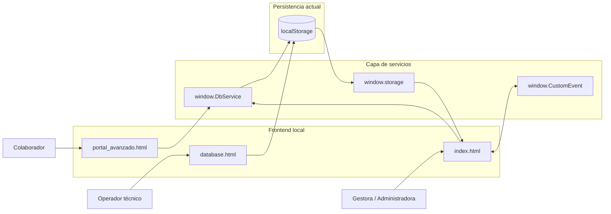
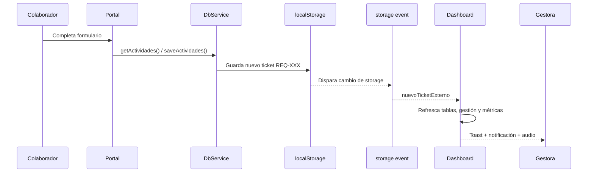
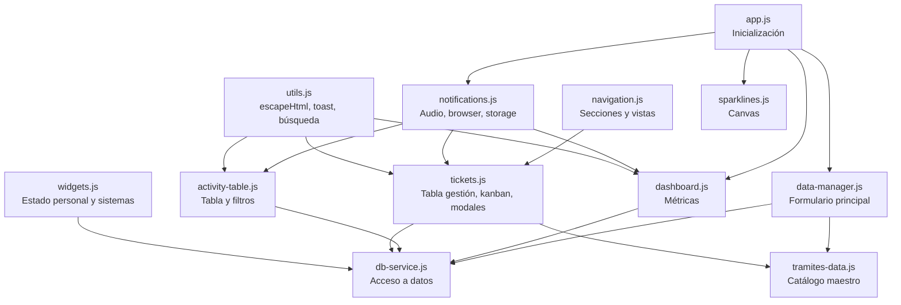
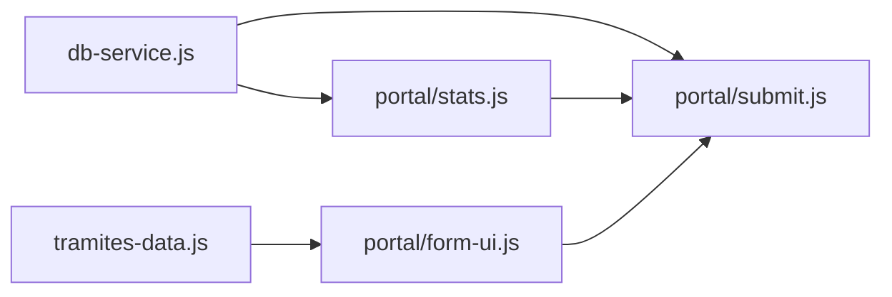

# Arquitectura del Sistema

Este documento describe la arquitectura real del proyecto a fecha de mayo de 2026, validada contra el código fuente actual. Su objetivo es servir como mapa técnico para desarrolladores humanos y futuras IAs.

## 1. Resumen Ejecutivo

- El proyecto es una web app frontend servida localmente desde Node.js usando `http-server`.
- La persistencia actual no usa backend real: se apoya en `localStorage`.
- El acceso a datos está encapsulado en `window.DbService`.
- El dashboard administrativo usa una arquitectura modular orientada a eventos.
- El portal de colaboradores está modularizado, pero mantiene algo más de acoplamiento directo entre módulos.
- Existe una separación funcional entre tres superficies:
  - `index.html`: dashboard administrativo
  - `portal_avanzado.html`: portal de autogestión para colaboradores
  - `database.html`: herramienta manual de administración de datos

## 2. Vista de Alto Nivel



## 3. Estilo Arquitectónico

### 3.1 Local-First

La aplicación está diseñada para ejecutarse de forma autónoma en entorno local. Toda la lógica de negocio vive en frontend y la persistencia temporal depende del navegador.

### 3.2 Frontend modular en JavaScript vanilla

No se usa framework. La composición se resuelve con:

- HTML estructural
- CSS modular por capas
- módulos JS cargados por orden en el navegador
- objetos globales en `window` para exponer funciones compartidas

### 3.3 Arquitectura orientada a eventos

El dashboard evita el acoplamiento directo entre módulos mediante eventos como:

- `actividadGuardada`
- `ticketActualizado`
- `sectionChanged`
- `nuevoTicketExterno`

## 4. Componentes Principales

### 4.1 Dashboard administrativo

Archivo principal: `entorno_local/index.html`

Responsabilidades:

- registrar actividades
- visualizar métricas
- consultar actividades con filtros
- gestionar tickets en tabla y kanban
- editar tickets
- publicar estado del personal
- publicar estado de sistemas
- recibir notificaciones de nuevas solicitudes

### 4.2 Portal de colaboradores

Archivo principal: `entorno_local/portal_avanzado.html`

Responsabilidades:

- crear nuevas solicitudes
- elegir área y tipo de trámite
- validar reglas especiales para firmas
- mostrar historial personal
- mostrar estado del personal TI
- mostrar estado de sistemas

### 4.3 Administrador de datos

Archivo principal: `entorno_local/database.html`

Responsabilidades:

- CRUD manual de `db_actividades`
- CRUD manual de `db_solicitantes`
- CRUD manual de `db_responsables`

Particularidad:

- no usa `DbService`
- no participa en la arquitectura modular principal
- usa JavaScript inline y acceso directo a `localStorage`

## 5. Flujo Frontend -> Persistencia -> Sincronización



## 6. Módulos del Dashboard



### Responsabilidad por módulo

| Módulo | Líneas | Responsabilidad |
|---|---|---|
| `app.js` | 25 | Arranque del dashboard. Define `currentSection`. Llama init de otros módulos. |
| `db-service.js` | 137 | Fachada de persistencia. 14 métodos async. Envuelve `localStorage` en promesas con `setTimeout(300)`. |
| `tramites-data.js` | 38 | Catálogo maestro de trámites por área. Expone `window.tramitesArea1` (17 items) y `window.tramitesArea2` (7 items). |
| `utils.js` | 103 | `escapeHtml`, `showToast`, búsqueda global con debounce. |
| `data-manager.js` | ~200 | Formulario principal de creación de actividades. Carga dropdowns. |
| `navigation.js` | 89 | Navegación entre secciones y conmutación tabla/kanban. Emite `sectionChanged`. |
| `dashboard.js` | 184 | Tarjetas estadísticas, tickets recientes, network pulse. Escucha `actividadGuardada`, `ticketActualizado`, `nuevoTicketExterno`. |
| `activity-table.js` | ~260 | Filtros y render de tabla de actividades recientes. |
| `tickets.js` | 388 | Módulo más grande. Solicitudes activas, kanban, edición modal, registro rápido. |
| `widgets.js` | ~150 | Widget "Mi Estado" y control de estado de sistemas. |
| `notifications.js` | 107 | Notificaciones del navegador (`Notification API`), audio sintético (`AudioContext`), escucha del evento `storage`. |
| `sparklines.js` | ~50 | Gráficos canvas decorativos. |

## 7. Módulos del Portal



### Responsabilidad por módulo

| Módulo | Líneas | Responsabilidad |
|---|---|---|
| `form-ui.js` | ~150 | Comportamiento visual del formulario: `setPriority`, `actualizarTramites`, `verificarPresencialidad`, `verInfoSistema`. Reglas de UI para firmas. |
| `submit.js` | 133 | Validación y creación del ticket `REQ-XXX`. Construye objeto de 16 campos. Usa `DbService` con promesas. Manejo de error con `catch`. |
| `stats.js` | ~240 | Historial personal, estadísticas, sincronización visual del portal. `cargarNombres`, `buscarMisTickets`, `calcularEstadisticas`. |

## 8. Capa de Datos

### Claves principales en `localStorage`

| Clave | Contenido | Usado por |
|---|---|---|
| `db_actividades` | Tickets y actividades (array JSON) | Dashboard, Portal, Database |
| `db_solicitantes` | Catálogo de solicitantes (array de strings) | Dashboard, Portal, Database |
| `db_responsables` | Catálogo de responsables TI (array de objetos o strings) | Dashboard, Database |
| `db_estado_personal` | Estado publicado del personal (objeto) | Dashboard, Portal |
| `db_sistemas` | Estado de sistemas (objeto con servidor, contable, red) | Dashboard, Portal |
| `db_mi_seleccion` | Selección local del widget "Mi Estado" (string) | Dashboard |

### Forma de acceso

- `index.html` y `portal_avanzado.html` deben usar `DbService`
- `database.html` accede directo a `localStorage`

## 9. CSS Modular

Estructura por capas con archivo de entrada `css/main.css`:

```
css/
├── main.css              → @import de todos los demás
├── base/
│   ├── variables.css     → Tokens de color, tipografía, espaciado
│   └── reset.css         → Reset global (overflow:hidden para dashboard)
├── layout/
│   ├── sidebar.css       → Barra lateral de navegación
│   ├── topbar.css        → Barra superior
│   └── grids.css         → Grid general y utilidades
├── components/
│   ├── buttons.css       → Botones
│   ├── cards.css         → Tarjetas
│   ├── forms.css         → Formularios
│   └── widgets.css       → Widgets y badges
└── themes/
    └── portal-theme.css  → Override para portal (scroll, badges)
```

- Dashboard: Dark mode, Glassmorphism oscuro, DM Sans + Space Grotesk
- Portal: Glassmorphism claro, degradado rosa/azul, DM Sans
- `portal-theme.css` sobreescribe `reset.css` con `body.portal { overflow-y: auto }` (DEC-007)

## 10. Autenticación y Autorización

Estado actual:

- No existe autenticación real
- No existen sesiones de usuario
- No existe autorización por roles en backend
- La separación entre colaborador y administradora es solo visual y por página

Implicación:

- El sistema es adecuado como MVP local o demo operativa
- No está listo para un despliegue multiusuario real sin backend y control de acceso

## 11. Backend y Servidor

Estado actual:

- `server.js` usa `http-server` (no Express, a pesar de lo que dice `agent.md`)
- Sirve la carpeta `entorno_local/` en puerto 3000
- No tiene rutas, middlewares ni lógica de servidor

Migración futura declarada:

- Node.js/Express + PostgreSQL
- `db-service.js` ya tiene interfaz basada en promesas
- La UI no depende de `fetch` ni de SQL directamente
- La migración consiste en reemplazar el interior de `DbService`

## 12. Escalabilidad Técnica

Lo que sí ayuda a escalar:

- Responsabilidades separadas por módulo
- Servicio de datos centralizado
- Eventos desacoplados en dashboard
- Catálogo de trámites con fuente única
- CSS modular

Límites actuales:

- `localStorage` no escala para colaboración multiusuario real
- El evento `storage` solo sirve entre pestañas del mismo navegador
- No hay consistencia transaccional
- No hay control de concurrencia
- No hay auditoría ni trazabilidad persistente

## 13. Desalineaciones Detectadas

Diferencias entre la documentación existente y el estado real del código:

| Desalineación | Detalle |
|---|---|
| `server.js` no usa Express | Usa `http-server`. `agent.md` dice "Express en puerto 3000". |
| Branding "IT Command" | `app.js` línea 2 dice "IT COMMAND - JavaScript Frontend". |
| `agent.md` menciona `script.js` | Ese archivo fue eliminado en mayo 2026 y reemplazado por 11 módulos. |
| `agent.md` menciona `styles.css` | Ese archivo fue eliminado y reemplazado por `css/main.css` + subcarpetas. |
| `agent.md` menciona `portal.html` | Ese archivo fue eliminado en mayo 2026. |
| `agent.md` dice "portal_avanzado.html tiene CSS/JS inline" | Ya no. Fue limpiado completamente (DEC-002 resuelta). |
| `dashboard.js` referencia `#ticketsList` | Ese nodo no existe en `index.html`. Código muerto. |
| `dashboard.js` referencia `#networkMetrics` | Ese nodo no existe en `index.html`. Código muerto. |
| `DEPENDENCIES.md` dice "portal.html — en desuso" | Ya fue eliminado, la referencia es obsoleta. |

## 14. Recomendación de Evolución

Orden sugerido:

1. Corregir `agent.md` para reflejar el estado real (estructura, archivos eliminados, http-server vs Express).
2. Limpiar código muerto en `dashboard.js` (`ticketsList`, `networkMetrics`).
3. Normalizar branding: eliminar referencias a "IT Command".
4. Mover `database.html` hacia la misma capa `DbService`.
5. Sustituir `localStorage` por API real.
6. Añadir autenticación, autorización y modelo de datos persistente.

## 15. Recomendaciones para IAs Futuras

- Leer primero `CONTEXT.md`, `docs/DEPENDENCIES.md` y `docs/DECISIONS.md`.
- Validar siempre la documentación contra el HTML y los módulos reales.
- Antes de tocar módulos, verificar si el nodo DOM que esperan sigue existiendo.
- Tratar `database.html` como herramienta especial, no como referencia arquitectónica.
