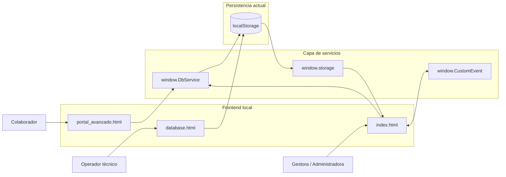
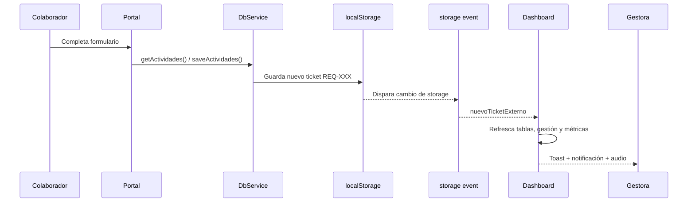
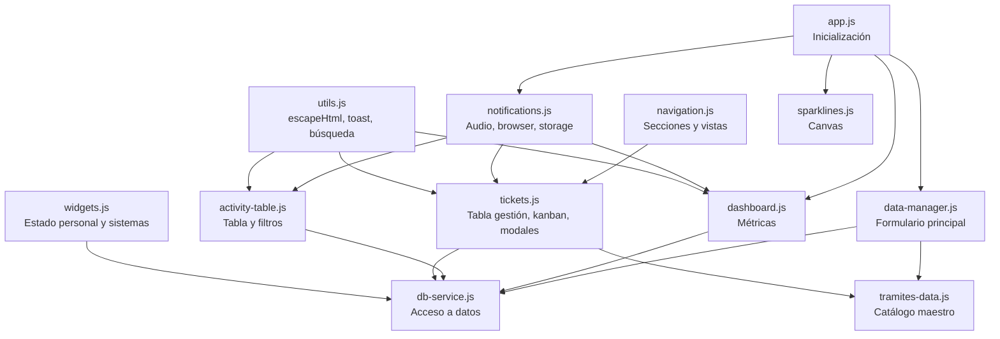
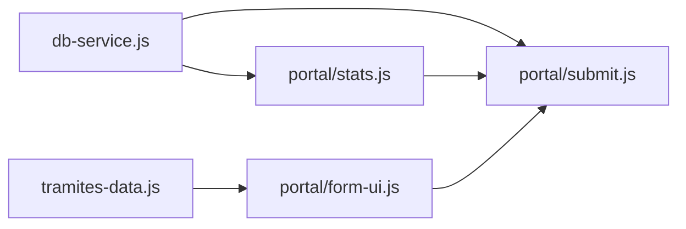

# Arquitectura del Sistema

Este documento describe la arquitectura real del proyecto a fecha de mayo de 2026, validada contra el código fuente actual. Su objetivo es servir como mapa técnico para desarrolladores humanos y futuras IAs.

## 1. Resumen Ejecutivo

- El proyecto es una web app frontend servida localmente desde Node.js usando `http-server`.
- La persistencia actual no usa backend real: se apoya en `localStorage`.
- El acceso a datos está encapsulado en `window.DbService`.
- El dashboard administrativo usa una arquitectura modular orientada a eventos.
- El portal de colaboradores está modularizado, pero mantiene algo más de acoplamiento directo entre módulos.
- Existe una separación funcional entre tres superficies:
  - `index.html`: dashboard administrativo
  - `portal_avanzado.html`: portal de autogestión para colaboradores
  - `database.html`: herramienta manual de administración de datos

## 2. Vista de Alto Nivel

## 3. Estilo Arquitectónico

### 3.1 Local-First

La aplicación está diseñada para ejecutarse de forma autónoma en entorno local. Toda la lógica de negocio vive en frontend y la persistencia temporal depende del navegador.

### 3.2 Frontend modular en JavaScript vanilla

No se usa framework. La composición se resuelve con:

- HTML estructural
- CSS modular por capas
- módulos JS cargados por orden en el navegador
- objetos globales en `window` para exponer funciones compartidas

### 3.3 Arquitectura orientada a eventos

El dashboard evita el acoplamiento directo entre módulos mediante eventos como:

- `actividadGuardada`
- `ticketActualizado`
- `sectionChanged`
- `nuevoTicketExterno`

## 4. Componentes Principales

### 4.1 Dashboard administrativo

Archivo principal: `entorno_local/index.html`

Responsabilidades:

- registrar actividades
- visualizar métricas
- consultar actividades con filtros
- gestionar tickets en tabla y kanban
- editar tickets
- publicar estado del personal
- publicar estado de sistemas
- recibir notificaciones de nuevas solicitudes

### 4.2 Portal de colaboradores

Archivo principal: `entorno_local/portal_avanzado.html`

Responsabilidades:

- crear nuevas solicitudes
- elegir área y tipo de trámite
- validar reglas especiales para firmas
- mostrar historial personal
- mostrar estado del personal TI
- mostrar estado de sistemas

### 4.3 Administrador de datos

Archivo principal: `entorno_local/database.html`

Responsabilidades:

- CRUD manual de `db_actividades`
- CRUD manual de `db_solicitantes`
- CRUD manual de `db_responsables`

Particularidad:

- no usa `DbService`
- no participa en la arquitectura modular principal
- usa JavaScript inline y acceso directo a `localStorage`

## 5. Flujo Frontend -> Persistencia -> Sincronización

## 6. Módulos del Dashboard

### Responsabilidad por módulo

- `app.js`: arranque del dashboard.
- `db-service.js`: fachada de persistencia y capa de abstracción de datos.
- `tramites-data.js`: catálogo maestro de trámites por área.
- `utils.js`: utilidades transversales.
- `data-manager.js`: formulario principal de creación de actividades.
- `navigation.js`: navegación entre secciones y conmutación tabla/kanban.
- `dashboard.js`: tarjetas estadísticas y reacciones a eventos.
- `activity-table.js`: filtros y render de actividades.
- `tickets.js`: tickets activos, edición, registro rápido y kanban.
- `widgets.js`: “Mi Estado” y control de estado de sistemas.
- `notifications.js`: notificaciones del navegador y escucha del evento `storage`.
- `sparklines.js`: gráficos canvas decorativos.

## 7. Módulos del Portal

### Responsabilidad por módulo

- `form-ui.js`: comportamiento visual del formulario y reglas de UI.
- `submit.js`: validación y creación del ticket `REQ-XXX`.
- `stats.js`: historial, estadísticas y sincronización visual del portal.

## 8. Capa de Datos

### Claves principales en `localStorage`

- `db_actividades`: tickets y actividades
- `db_solicitantes`: catálogo de solicitantes
- `db_responsables`: catálogo de responsables TI
- `db_estado_personal`: estado publicado del personal
- `db_sistemas`: estado de sistemas visibles en portal
- `db_mi_seleccion`: selección local del widget “Mi Estado”

### Forma de acceso

- `index.html` y `portal_avanzado.html` deben usar `DbService`
- `database.html` accede directo a `localStorage`

## 9. Autenticación y Autorización

Estado actual:

- no existe autenticación real
- no existen sesiones de usuario
- no existe autorización por roles en backend
- la separación entre colaborador y administradora es solo visual y por página

Implicación:

- el sistema es adecuado como MVP local o demo operativa
- no está listo para un despliegue multiusuario real sin backend y control de acceso

## 10. Base de Datos y Backend Futuro

Objetivo declarado del proyecto:

- migrar a Node.js/Express + PostgreSQL

Punto de extensión previsto:

- `db-service.js` ya tiene interfaz basada en promesas
- la UI no depende de `fetch` ni de SQL de forma directa
- la migración ideal consiste en reemplazar el interior de `DbService`

## 11. Escalabilidad Técnica

Fortalezas:

- responsabilidades separadas
- servicio de datos centralizado
- eventos desacoplados en dashboard
- catálogo de trámites con fuente única
- CSS modular

Límites actuales:

- `localStorage` no escala para colaboración multiusuario real
- el evento `storage` solo sirve entre pestañas del mismo navegador
- no hay consistencia transaccional
- no hay control de concurrencia
- no hay auditoría ni trazabilidad persistente

## 12. Desalineaciones Detectadas

Estas diferencias son importantes para cualquier documentación futura:

- `server.js` usa `http-server`, no Express.
- Parte del branding y naming todavía conserva la herencia `IT Command`.
- La documentación histórica menciona `script.js`, pero ese archivo ya no existe.
- `dashboard.js` aún intenta renderizar bloques sobre contenedores no presentes en `index.html` como `ticketsList` y `networkMetrics`.

## 13. Recomendación de Evolución

Orden sugerido de evolución:

1. Consolidar la documentación con el estado real del código.
2. Corregir inconsistencias entre HTML y módulos del dashboard.
3. Mover `database.html` hacia la misma capa `DbService`.
4. Normalizar naming del dominio “Gestión Empresarial”.
5. Sustituir `localStorage` por API real.
6. Añadir autenticación, autorización y modelo de datos persistente.
